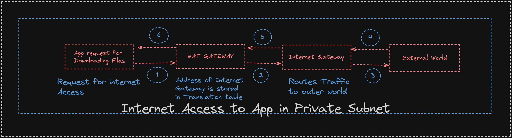

# AWS Interview Questions

---

## EC2

---

### What are the family of instance types in EC2?

- They are calssified into types as folows

- Majorly classified into the following as

- General Purpose (Starts with M) - eg M5a, M5ad, M6a
- Memory Optimized (Starts with R(Signifies RAM)) - eg C5, C5a, C5ad
- Compute Optimized (Starts with C(Signifies Compute)) - eg R5, R5a, R5ad

- Further classified into

- Storage Optimized
- High Performance Computing
- Accelarted Computing

### What are the Burstable Instances ?

- The t2, t3, t3a They provide best oprice for the performance ratio in the EC2 Instance Types.
- The t4g uses AMazons own processor `Gravitron`

### Does EC2 get the Public Address by Default ?

- `NO`, by default EC2 only gets Private IP Address

---

## Networking in AWS

---

### What is CIDR ?

- Classless Inter-Domain Routing(Widely Used than Classful Routing)
- It is used to provider the IP Address Allocation
- eg `172.16.0.0/16`

```
172.16.0.0 ==> It is the BASE IP
16 => Is the Subnet Mask
```

### How to calculate the no. of IP Addresses Available ?

- eg `172.16.0.0/16` => It is Divided into twor parts they are `Network Address` and `Host Address`
- `Host Address` - Representst he No. of IP Address taht can be allocated
- Calculated as Follows

```
1 Byte = 8 Bits
172.16.0.0/16 ==> It will be divided as 11111111.11111111.00000000.00000000
Masking is done form the right to left ; we have to cover 16 Bits.
Each Byte will contain about `256 Addresses` => From `0 to 255`

Host Addresses ==> Will cover upto 0.0
N/W Addresses ==> Will cover upto 172.16

=> For Host Addresses ==> 0.0 => 256 * 256 ==> 65536 Addresses - 2(As 2 IP;s are allocated for the Network Address and Broadcast Address)

No. of IP Addresses can also be derived from the Formula =>` [2 ^ (32 - (Subnet mask)) - 2]`
```

- No. of IP Addresses can also be derived from the Formula =>` [2 ^ (32 - (Subnet mask)) - 2]`

eg 172.8.10.12/15
=> Using [2 ^ (32 - (Subnet mask)) - 2] = [2 ^ (32 - (15)) - 2] = 131070 IP Addreses can be allocated

### What is VPC?

- It is the Private Cloud within our cloud
- It conist of the `Public` and `Private` Subnet.

- The `Public Subnet` attaches to the `Internet Gatway`; Generally the `Bastion Host(Jump Server)` or `Load Balancers` are kept inside the Public Subnet.
- The `Private Subnet` attaches to the `Network Translation Gateway`; Generally the Applications are stored inside the Private Subnet (Least Privileage Access); The Internet can only get accessed with the help of NAT Gateway ==> NAT Gateway connects to the Internete Gatway and gets reply back from the outer world.

### How Public and Private Subnet are from Each Other ?

- Public Subnet attaches to the Internet gateway and Private Subnet to the NAT Gateway,

### What is incoming and outgoing traffic called in terms of the VPC?

- Incoming Traffic ==> `Ingress traffic / Inbound Traffic`
- Outgoing Traffic ==. `Egress Traffic / OutBound Traffic`

### How app inside the Private Subnet connects to the Internet ?



### NACL(Network Access Control List) VS SG (Security Groups)

- `NACL` they are the set of the Rules that are acting at the `Subnet Level`
- In `NACL` the `Inbound Rules` can set to be Something else and `OutBound Rules` can be set to `Blocked`
- `NACL` are set for the `StateLess Routing`
- NACL the Rules ranges from the `[1 to 65535] [1 with the Highest Priority]`.

- `SG` they are set of Rules that are acting at the `Instance Level`
- IN `SG` once the `Inbound Traffic` is `allowed`; then the `OutBound Traffic` is `allowed by Default`.
- `SG` are set for the `Stateful Routing`.

---

## LOAD BALANCERS

---

### What is the Difference Between the High Avalalability [HA] vs Fault Tolerance ?

- `HA` deals with the `scalability of the application` and making it available for the users even if one instance goes down.
- Fault Tolerance deals with adding the `Application in the Multiple Avalability Zones in the Region`; avoiding to become the `Single Point Failure`.

### What is SSL Termintaion?

- Its relative whenever we are using the `HTTPS Traffic`
- When serving the HTTPS Traffic we need to add the SSL Certifcates for proper encrypted communication.
  

### OSI Refrence Model Layers

- `Layer 7` - `Application Layer` `(ALB Operates at this level)` - Users can access thius layer; Can understand HTTP, HTTPS, PATH, Host Based Routings
- `Layer 6` - `Presentetion Layer` - Gives out the format in whihc the data can be represented eg zip, JPEG.
- `Layer 5` - `Session Layer` - Gives Sessions Created or Not and Valid Sessions or Not ?
- `Layer 4` - `Transport Layer` `(NLB Operates as this Level)` - Takes care for managing the Packet using the `TCP` or `UDP`
- `Layer 3` - `Network Layer` - Finds Shortest Route to Transmit Data.
- `Layer 2` - `Data Link Layer` - Converts Data to Frames
- `Layer 1` - `Physical Layer` - Converst Frames to Bits and Transmission Wires

### What are the `target groups` in LB ?

- They are nothing but the set of Instances clubbed together.
- Tagret Groups are used to perform `HealthChecks` on the Instances.
- Based on some `Rules` the routes the traffic to `Target Groups`

### What are some of the Algorithms used by the Load Balancers?

- These are some of the most famous Algorithms used in the Load Balancers

- Round Robin
- Weighted
- `Sticky Sessions` => When the request is routed form the EC2 instance and another request comes from the same user then the request is routed to the same EC2 Instance. `[Preffered for Stateful Applications]`

---

## DNS (ROUTE 53)

---

### What is DNS ?

- DNS porvides mapping of the URL to the corresponding IP Address.

---

## Miscellaneous

---

### What is the difference between stopping and termintaing the Ec2 instance?

- Stopping the Ec2 instances will change the IP Addresses; but it will not be removed from the AWS Console
- Terminating the AWS Resources will delete the instance from the AWS Console also.

### Can we add an Existing Instance into the Autoscaling Group ?

- YES, Attach Instance => Select Instance

### Cloud Watch vs Cloud Trail

- `Cloud Watch` => used for monitoring and logging analysis purpose of the application;
- `Cloud Trails` => USed for the auditing the services and the Users for the Compliance Purpose; Trails allow to capture activity and deliver to cold storage.

### Reserved Instance VS On Demand Instance

- `Reserved Instances` they are used or the longterm purpose (1 to 3 Years); so they are provided at a discount; payment method can be all upfront, patial upfront or no upfront at all.
- `On Demand Instances` they are used for shoreter interval of time; No Long Term Commitment; PAY AS YOU USE;

### Which type of scaling is recommended for RDS?

- Types are `Vertical` and `Horizontal` Scaling
- Vertical => When the Workload is moderate; there is predicatbility in workload pattern; requires modest performance then we can go for the vertical scaling (Increase the CPU and Memory)
- Horizontal => When the Worload are extereme; no predicatbility in the workload pattern; requires Concurrencyto achieve HA, Fault Tolerance and scalability use Horizontal Scaling (Increase the count of replicas)

### What is maintainace window in RDS ? Can we access the RDS inatcne in the maintainanace window?

- Maintainance window in RDS can be due to the S/W patching, Hardware Upgradation, Engine Upgrades other routine checks for the Hardware and health and relaibility.
- We can acess the RDS instances during the maintainance window if and only if they are Fault Tolerant i.e. they are replicated in the various Avalability Zones.

### What are Different types of LB in AWS?

- Classic LB(Deprecated)
- Application Load Balancer (Widely used in MicroService Applications)
- Network Load Balancers (Widely usd for the High Throughput Applications such as Gaming Applications)
- Gatway Load Balancers (Used for Migrationg Onpremise to the AWS Cloud)

- `ALB` => Operates at Layer 7 of OSI (Application Layer); Supports HTTP and HTTPS Traffic; USed for MS applications; It understands `Paths` and `Host Headers`.

- `NLB` => Operates at Layer 4 of OSI (Transport layer); Supports the TCP and UDP Connections; Supports the High latecy applications such as Gaming Applications.

### Explain the steps to setup VPC with subnets and Everyting?

- Add the CIDR Range (To get the PRivate IP Ranges)
- Create `Subnets` with the `Private` and the `Public` Subnet.
- The Applications are put under the `Private Subnets` and they are connected to the `NAT gateway` inturn connects to the `Internet Gateway`; For Applications requring the Internet Connction.
- The `LoadBalancers` , `NAT Gateway`, `Internet Gateway` and the `JumpServers(Bastion Host)` they are put onto the `Public Subnets`
- Setup the `NACLs` for securing the Access to `Subnet Level` also adding the `Security Group` for securing the Access to the `Instance`.
- Enable the monitoring => Enable the `VPC Flow Logs` and monirtor it using the `Cloudwatch`.

### In the case of the AWS Pipeline how can we secure the API KEYS and the Secrets , other credentails ?

- In AWS CICD PIpeline we can use the `CodeBuild` , `Codepipeline`, `CodeCommit`.
- TO secure the credential of the pipeline we can use the `AWS KMS` or `AWS Secret manager` or `AWS Parameter Store`.
- These services can also be used to `Rotate the secrets` and give access to CICD Services.
- Further we can enable the `CloudTrail` for auditing the user's interaction with the server.

### What are some of the services which are not region specific?

- `AWS IAM` , `AWS CloudFront`, `AWS Route53`

### When to use the EC2 and Lambda ?

- When we want to run some servers(Web servers , db servers) then we can make use of the `EC2 instance.`
- We want to run some process fro a very short amount of time consuming less resources and without managing the servers
- `Lambda` are event driven; short lived with automatic scaling.

### Cloud Fromation has an error in template that you have committed; what could happen as tghe result of error; how would you correct it?

- If we have commited it but it has caused errors so it will not create the Infrastructure ; and will not run.

```
Stacks in AWS ~ Infrastruture Code in Terraform
Stacks can be managed as a Single unit

Template in Cloud Formation is same as Template Written in the `YAML or JSON`
```

### HOw can we disable the EC2 Instance Public IP Address?

- Disable the `Auto-assign Public IP:`

### I have an on prem data center and want private connectivity between AWS network to on premise Datacenter. How to configure it and which services

- It can use the `AWS Services` like `AWS Direct Connect` and `AWS VPN`
- `AWS Direct Connect` => It establishes a Private Connection; `NOT on the Internet Connections`.
- `AWS VPN` => It establishes a Private Connection; `On the Internet Connections`.

### If IP of VPC OR subnet IP range got occupy by all server then what action do we need to perform?

- SO what we need here to do is that
- 1. Expand the `Subnet Size`: This might involve adjusting the CIDR (Classless Inter-Domain Routing) block associated with the subnet.

- 2. Add `Additional Subnets`: If expanding the existing subnet is not feasible or if you need to segregate resources, create additional subnets within the VPC.

- 3. Implement `Elastic IP Addresses` :Instead of statically assigning IPs from the subnet pool. EIPs can be associated and disassociated from instances as needed, allowing for more efficient IP address utilization.

- 4. Maybe consider using `IPV6`: If IPv6 is an option for your infrastructure, consider implementing it to significantly expand the available IP address space.

### Explain the purpose of a VPC's route tables. How are they associated with subnets?

- The purpose of a Virtual Private Cloud (VPC)'s route tables is to control the routing of network traffic within the VPC. Route tables determine where network traffic is directed based on its destination IP address. They essentially act as a set of rules that guide the traffic flow within the VPC.

### What is a Virtual Private Network (VPN) connection in the context of AWS VPC? How does it differ from Direct Connect?

- AWS VPC allows you to connect the `On Premise DataCenters` to `AWS VPC`; It establishes an encrypted tunnel between your network and the VPC, allowing secure communication between resources in your VPC and your on-premises infrastructure.

- AWS VPN allows you to create a private connection; `with Internet Connection`.
- AWS Direct Connection you to create a private connection; `without Internet Connection`

### What is VPC Flow Logs, and why would you enable them?

- `VPC FLOW LOGS`: They are IP traffic going to and from network interfaces in your VPC.
- It can be better used with the monitoring tools such as `AWS Cloud Watch`and further interact with the `AWS CloudTrail`

### Describe the process of migrating an EC2 instance from one VPC to another ?

- Prepare the target VPC with necessary resources.
- Prepare the EC2 instance for migration.
- Create an AMI of the EC2 instance.
- Copy the AMI to the target region if needed.
- Launch a new instance in the target VPC using the AMI.
- Update DNS records and application configurations if applicable.
- Test and validate the new instance's functionality.
- Monitor the new instance and decommission the source instance once migration is successful.

### What if the PEM file is not present then how can we connect to the EC2 instance?

- Use `AWS Systems manager` ==> `Session Manager` : Session manager actually uses the IAM Permissions for conecting to EC2 insatnce.
- Use `EC2 Snapshot Instance` ==> If we have the EC2 snapshot instance of the `Root Rolume`; then create a `new volume` from this and attach it to the new instance.

### EBS vs S3 vs EFS

| Feature           | EBS (Elastic Block Store)                                    | S3 (Simple Storage Service)                                  | EFS (Elastic File System)                                                 |
| ----------------- | ------------------------------------------------------------ | ------------------------------------------------------------ | ------------------------------------------------------------------------- |
| Storage Type      | Block-level storage volumes                                  | Object storage                                               | File storage                                                              |
| Protocol          | N/A                                                          | N/A                                                          | NFS (Network File System)                                                 |
| Accessibility     | Attached to single EC2 instance at a time                    | Accessible via unique URLs                                   | Accessible by multiple EC2 instances concurrently                         |
| Durability        | Replicated within an Availability Zone                       | Highly durable across multiple Availability Zones            | Highly durable across multiple Availability Zones                         |
| Scalability       | Scales with instance type, can be manually resized           | Infinitely scalable                                          | Automatically scales based on demand                                      |
| Use Cases         | Database storage, boot volumes, file systems                 | Static website hosting, data archiving, content distribution | Content management systems, development environments, analytics workloads |
| Backup/Recovery   | Snapshots                                                    | Versioning and Cross-Region Replication                      | Automated backups and point-in-time recovery                              |
| Performance       | Low-latency access, provisioned IOPS available               | Designed for low-latency access at scale                     | Burstable performance with automatic scaling                              |
| Pricing Model     | Pay for provisioned storage, provisioned IOPS, and snapshots | Pay for storage used, requests, and data transfer            | Pay for storage used                                                      |
| Access Management | IAM roles and policies                                       | Bucket policies and IAM policies                             | POSIX permissions and IAM policies                                        |

### You want to store temporary data on an EC2 instance. Which storage option is ideal for this purpose?

- The default storage for the EC2 instance is `EBS`
- If we want to have the temporary usage then we can take care of it using the ` instance local storage` typically provided by `instance store volumes.`; they are ephemeral storage directly attached to EC2 instance; didnt get persisted beyond the lifetime of the instance.

### If my RDS is running out of space how will you resolve that without launching other RDS?

- Can enable the `AutoScaling Feature` in AWS for AWS RDS.
- Further we can make the unused / unnsesasary data cleanup (old logs, temporary tables, or outdated records) it would free up more data in RDS
- ` Manually increase the allocated storage`; do this through AWS Console , CLI or SDK.
- Take a snapshot of your RDS instance and restore it to a new instance with `larger storage capacity.`

### How will you take backups using Lambda?

```
import boto3
import datetime

def lambda_handler(event, context):
    # Initialize AWS SDK clients
    rds_client = boto3.client('rds')
    ec2_client = boto3.client('ec2')

    # Define the list of RDS instances and EC2 instances to backup
    rds_instances = ['your-rds-instance-id']
    ec2_instances = ['your-ec2-instance-id']

    # Create RDS snapshots
    for instance_id in rds_instances:
        try:
            snapshot_id = 'rds-snapshot-' + instance_id + '-' + datetime.datetime.now().strftime('%Y-%m-%d-%H-%M-%S')
            rds_client.create_db_snapshot(DBSnapshotIdentifier=snapshot_id, DBInstanceIdentifier=instance_id)
            print(f"Snapshot created for RDS instance {instance_id}: {snapshot_id}")
        except Exception as e:
            print(f"Error creating snapshot for RDS instance {instance_id}: {str(e)}")

    # Create EBS snapshots
    for instance_id in ec2_instances:
        try:
            volumes = ec2_client.describe_volumes(Filters=[{'Name': 'attachment.instance-id', 'Values': [instance_id]}])['Volumes']
            for volume in volumes:
                snapshot_id = 'ebs-snapshot-' + volume['VolumeId'] + '-' + datetime.datetime.now().strftime('%Y-%m-%d-%H-%M-%S')
                ec2_client.create_snapshot(VolumeId=volume['VolumeId'], Description=snapshot_id)
                print(f"Snapshot created for EBS volume {volume['VolumeId']}: {snapshot_id}")
        except Exception as e:
            print(f"Error creating snapshot for EC2 instance {instance_id}: {str(e)}")

    return {
        'statusCode': 200,
        'body': 'Backup process completed successfully.'
    }

```

### What is VPC Peering ?

- It is the network connection between the two VPC's it acts as the private Connection and VPCs can connect to each other as if they are part of the Same Network in the Same Region.
- VPC peering enables you to `connect VPCs belonging to the same AWS account or different AWS accounts`, **`as long as they are in the same region`**
- Overall, the aim of VPC peering is to enable `secure` and `efficient` communication between resources in different VPCs within the `same AWS region`, thereby facilitating the building of complex, multi-tiered architectures and enabling collaboration between different applications and environments.
