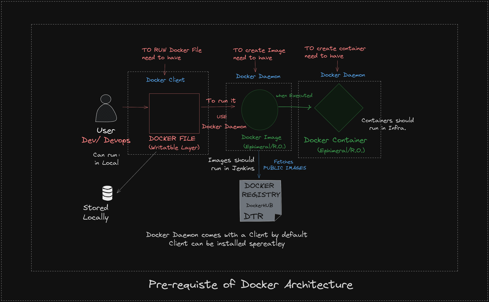
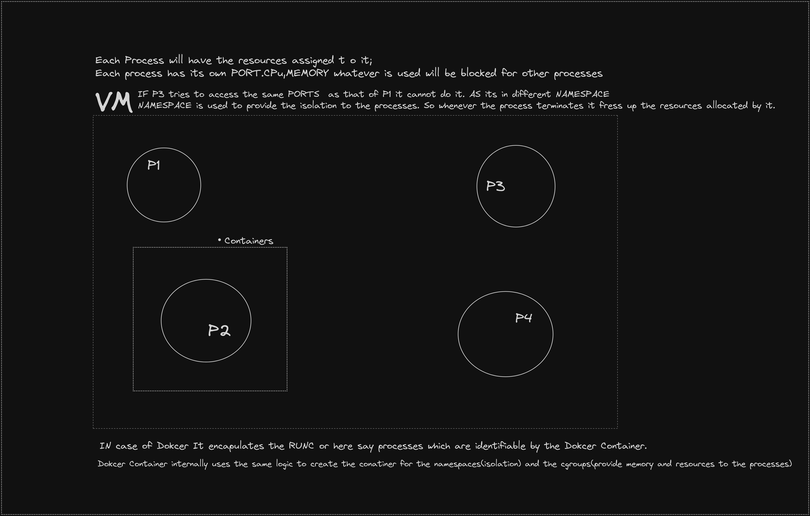

# INTERVIEW QUESTION WITH ANSWERS

### What are Containers ?
- Containers are kind of advanced VM's 
- They are wrapped around the Application + Dependencies + System Binaries
- In the containers are light weighted as they do not contains the whole OS in it.
- It resolves the problem of "It runs on my machine" as it creates and environment for the Application with its reqired dependencies within.

### What if other person wants to use our application (running on our computer) ?
- We would provider them with the "Docker Images"
- Docker Images will have the Application + Dependencies + System Binaries; and Docker Image's runiing instance is nothing but the Docker Container.

### What are the type dependecies which are included in the Containers ?
- These are the run time dependencies which are needed when runing the applications
- There are alos other types of Dependencies like Build Time Dependencies, Compile Time Dependecies but Docker does not deasl with it.

### What is docker damemon (dockerd) ?
- dockerd is responsible for building running and mananging the containers

### What is a Cluster ?
- A cluster is atleast compromising of 2 major components they are 
  - Master Node <Control Plane>
  - Worker Node <Data Plane>
- Cluster can have multiple masters and workers also generally it compomises of the multiple master nodes; which are in the ratio master:worker set to 1:2.
- For every master node we need to have ideally 2 worker nodes for the high avalability [H.A.]

### Features of the Containers ?
- The containers provides isolation.
- Each container is provided with the help of namespaces and cgroups [control groups].
- namespaces => Provides the isolation
- cgroups => Provides manages the CPU and memory
- In the Docker all this is internally handeled we do not directly need to deal with this in detailed extent.

### What if we have 10000's of Containers ? Hiow to mananged them ?
- It can be managed via the help of Orchestrators. Orchestarctors are the one who keeps the tracks of each containers and maintains them according to our desired state.
- Orchastrators only work is to manage runtime of the containers; let it be 100 or 1 million it doesnt maer to it it juts only needs to manage the runtime of containers.
- To manage the reosurcess of the scaled instances also they can be used / portfolio management of resources in K8's.
- Some very famous orchestartors are Kubernetes[K8's] and Docker Swarm.

### What was before K8's then ?
- People used to use the Docker Swarm (techincally it is used alos now but in less favour) for Orchestration.
- Docker Swarm has some shortcomings like
  - Usable for simpler usecases; missing advance orchestration feratures like auto-scaling, rolling updates, supoport to stateful applications.
  - Docker swarm cannot be extended but K8's can with the help of CRD's [Custom Resource Definetions] and Operators
  - Docker swarm is loosing the commiunity adoption and getting replaced with the K8's. 

### What is granular most level of object in K8's ?
- Pod is the one granular most level object that we can have conrtrol over.
- even every component is boiled doen to the k8's object ; Which are nothing but the Pods running for the each of Objects.
- It further boild down to Containers; Pods are nothing but the set of containers running.

- Summarised it as ANY K8's Object ==> PODS ==> Containers
- That is why Folks learnming Containers is essentential.

### Why generally dont go to learn the managed Cluster directly?
- In the manged clusters whole of the master Node <Control Plane> is just hidden and we are onkly given the control of the worker nodes.
-But it is essential to know the working of the API Server and how it interacts with the other compoenents of master as well as the worker nodes.
- Some well known managed services are AWS EKS, Azrue AKS.

### How to determine that a Node is of type master or worker?
- Master Node(s) should have the components like 
  - **KUBE API SERVER** (THE MAIN COMPOENENT)
  - **ETCD** (KEY: Value Data Store; Stores the meta data of scheduling)
  - **Control Managers** (Determines Curr. vs Desired State; deals with components like Dep. ,RS, DS etc.)
  - **Scheduler** (Schedules the Pod according to State of Cluster)
  - **Cloud Control Manager**[CCM] (Optional)

- Worker Node(s) should have the components like
  - Application+ Dependecies + Sys Binaries in Docker Images
  - Docker Containers made from Docker images
  - **Kube Proxy** (Networking Slave of KubeAPI server)
  - **Kubelet** (It is Slave of Kube API Server for managing the creating and managing Pods; Runs on each Node)
  - Container Network Interface [C.N.I] (Weavenet, Calico, Tiger)
  - Conatainer Runtime Interface [C.R.I] (runc, rkt, cri-o)

### Where does the external user interact with the Kubernetes ?
- External user can only access the K8's via a Interface only.
- External user's endpoint would be the KubeAPI Server. In which they can connect but it needs to be with the proper authentication.  

### What aer different interfaces through which we can connect to the K8's ?
- kubectl (Most widely used for the managed services to connect to the Kubernetes Kube API Server)
- Browser
- Golang Binaries
- API's

### What are the Architectural flow of the K8's Architecture?

### What are the basic components in the VPC created by default?
- Public Subnet <Divide it into different avalibility zones>
- Private Subnet (Optional)
- Route Table
- Internet Gateway

### Benefits of Python
- Does not need to compile any code (It acts as both the High level language and the low level language) to interact with Kernel
- Python is an Interpreted language so no need to convert it to the low level language
- In Java it needs to be converted to .class(acting as the low level langauage) to interact with Kernal
- Docker File for the interpreted language will be different from that of the compiled code language.
- Python Docker File will not involve any build step in the Docker File
- In Java I suppose we need to first have a build (.war,.jar,.ear file) and then use it in the Docker File.

### Docker Architecture

_ To build the Docker File 
- **Docker File** will be made with the instrcutions provided on Docker Client(Docker Client is nothing but the CLI)
  - 15-20 Instructions
  - Consists of Commands and Argunments 
  - Each line in Docker File is considered as Layers
  - Docker image is nothing but the bundling of all the Layers in a bundle in the Docker File. 

  ## Line by Line Roles of Docker File
  - GO and Download the OS 
  - Follow the instrcution's Provided
  - Other Meta Layers
  - ENDPOINT - Last Line gives how to start the application (Known as **ENTRYPINT/CMD**)
  
  ## Flow of Docker File (Internal Details)
  - The image created would only be the **Read Only Object** (Nobody should be able to manipulate the image once created)
  - When the Docker Image is shared it should only care about the Endpoint as all other above layers are already inculcated(hardcoded) in the image.
  
  - When the image started it creates a virtual environment that is called as **Docker Container**
  - Docker Container will contains all the context of Docker File.
  - Docker Container will run the Entrypoint to create the files, perform operations, expose the network according to network configurations.
  - **NOTE** : Docker Container are also **READ ONLY** (Cannot manipulate a Docker Container) ; **If needed that kind of changes only can be done while creating the Docker File.** 
  - **NOTE** : Read ONLY also known as Ephemeral

## Whose responisbility is to write the DockerFile?
- It is the responsibility of the Developer and the Devops Engineer to write the Dockerfile
- They should work in the collabaration (insync) with each other.
- Generating Docker File is manual effort although there are automation tools for developing the DockerFile(as projects are not matured enough)
- We can ask the chatgpt to identify the loopholes in the Docker Files.

  

## Prerequiste to Docker Architecture
  

## What is Docker Daemon ?
- Docker Host actually consist of Docker Daemon and in turn **it manages the container runtime.**
- Docker Daemon can have the Docker Client running(as its a CLI for Docker).
- All the containers and Images will run in the Docker Daemons.

- Docker Client actually runs the commands ; the actual flow starts in the daemon; Client actually connects to the Daemons; all the containers and Images will run in the Docker Daemons.

- When hitting the docker command it will not run if only docker client is installed it needs both the docker client and the docker daemon to be installed in it.

- Docker is not a replacement of anything; It is concept of acontainerization

## Docker Internals for namespaces and Cgroups

## TO cehk the logs of Docker ?
- docker logs -f <container id>

## Some important docker commands ?
- docker container ls / docker container ps - To show the running docker containers
- docker containers ls -a / docker container ps -a - To show the all the containers (running and stopped)
- docker build -t <Image Name to be created> /path/to/the/dockerfile
- docker pull nginx - to pull the nginx image(it will not run this)
- docker run -p 9000:9000 nginx -To run the nginx image; mapping the PORT 9000 of the Host(LHS) to the PORT 9000 of the Container (RHS).
- docker exec -it <container_id> bash - To get inside the container and interact with it using the bash shell.
- docker stop <container_id> to stop the container 
- docker rm <container_id> only after stopping the container we can remove the container
- docker rmi <image name> only after removing all the containers asosiated with the docker image we can delete the docker image
- docker system prune -  will clean up any resources — images, containers, volumes, and networks — that are dangling (not tagged or associated with a container):
- docker rmi $(docker images -a -q) - To remove all the images
- docker rm $(docker ps -a -q) - To remove all the containers
- docker rm $(docker ps -a -f status=exited -q) - To remove all the containers with the status as exited.
- docker volume prune - TO remove all the volumes which are  dangling (not assosiated with anybody)
- docker rm -v container_name - To remove a container and its volume

