### Need of Docker Compose ?!

- In K8s the Pods are wrapped around the containers.
- The Docker Compose the Service is wrapped around the Container.
- 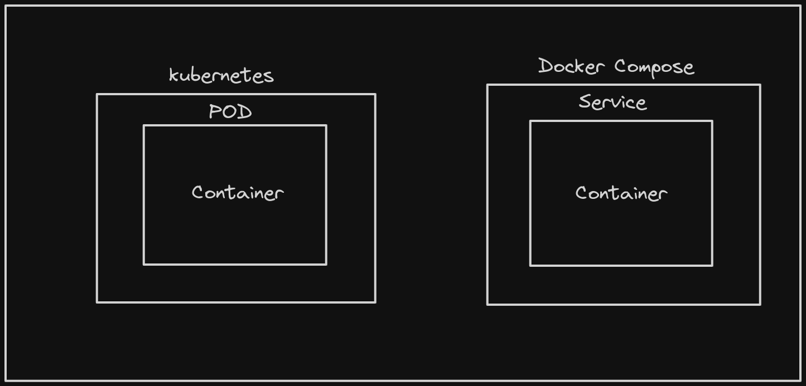

- In realtime sceanrio we will have multiple containers at scale (Replication of the containers for multiple applications; depending on requirement)
- So complexity starts to increase => We need to manage the routing.
- Docker solves using the 2 solutions in Docker
  - Docker Compose (Provides structure to Docker; with the help references of Services)
  - Docker Swarm (Competetor to K8)

### Docker Compose:

- Docker Compose will still use the Docker commands; but the Docker Compose Services will be the way to talk to Docker Daemon.
- When you call somebody on the basis of names in the container; we call it as the service. As name remains the same and Private IP changes after container gets down and restarts.

### Linmitation of Docker

- Run a container for python flask app(9000) and nginx(80) and try to connect for both of them as they lay in the same network(bridge)
- Do it using curl ==>

```
# From the nginx container <Go to nginx container using bash>

curl -v <IP of Flask>:<Port on whihc is hosted 9000>
```

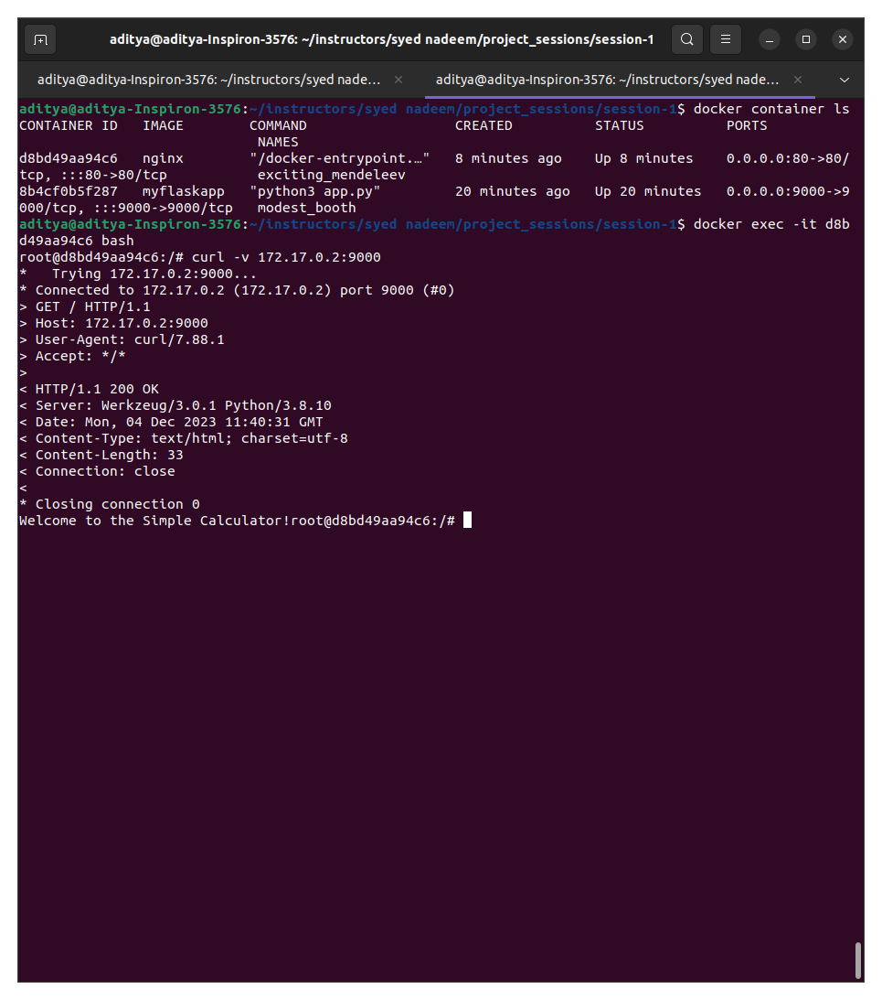

- But in the above frame there is hard assosiation of IP; when container resarts we have to manually change / maintain the IP's in it (refactor)

Refer demos in session 1

### What if we refer via the container_name ? [MUST READ]

- But instead of IP if give the name of the container it will not be able to connect.

- **Docker does not entertain the concept of Service Discovery**
- Docker understands the concept of Service Inherently; even though it supports it.
- **Docker understands the name, network and gateway; but it will not entertain the communication over the Services.**
- So refactoring and managemnt becomes a tedious task.

```
curl: (6) Could not resolve host: modest_booth
```

- If we create a new network and add our containers to it; then we can successfully connect the container via the container names.

```
#TO create the network what we have:
docker network create local_network

#It will be of type bridge by default & scope will be set to local


```

- It means the communication from one container to another should not stop at any level now.(as we have scope=local)
- But as **_Concept of Service is not inherent to Docker so we need to explicitly need to create the network; then Docker realises and allows us the DNS mapping (Name to IP Mapping)_**

- Again restrat the containers with the name and ports; Add the network (local_network that we created just now)

```
docker run --network local_network --name nginx -d -p 80:80 nginx

docker run --network local_network --name flask -p 9000:9000 myflaskapp
```

- After doing this and executing the script in the nginx we are able to connect via the container names.

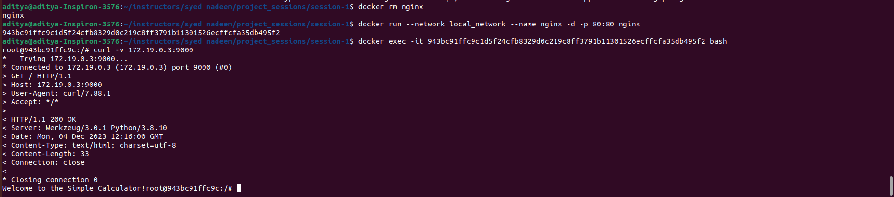

### What if we need to have the network restrictions in place for the containers in the same neytwork.

- eg> Only the backend should talk to the DB but if the UI wants to connect directly to DB it will restrict it.
- For this we need to manage multiple layers of Networks to restrict it. i.e. Concept Of Ingress and Egress comes into the Play here **(Concepts of Kubernetes)**
- The service filtering comes into play here and its covered in Docker Compose
- Docker does not provide the concept of **Load Balancing.**
- So we need to manually managed the entries of applications (its gateway and the IPAddresses)

### How will UI container decide where to go to i.e. in app 0, app 1 or app 2 contaier ?

- There needs to be a controller suggesting where to go due to some reasons.
- Docker there is no way that it will give logic out of box for suggesting the containers where to connect to the next container.

### Why Docker to DockerCompose then ?

- Docker works best in isolation.
- Every application needs to be containerised but every conatiner cannot be deployed intop the production because of the flaws of Docker discussed above.
-

### Install Docker Compose

Refer Demos in session 2; part 1

```
sudo curl -L "https://github.com/docker/compose/releases/latest/download/docker-compose-$(uname -s)-$(uname -m)" -o /usr/local/bin/docker-compose


sudo chmod +x /usr/local/bin/docker-compose

cat docker-compose.yml

docker-compose up -d
docker-compose ps
docker-compose up -d --scale <service_name>=2

#part-2
# understand how one has to create a self managed load balancer in docker
docker-compose build <service_name>
docker-compose up <service_name>

##clean up
docker rm -vf $(docker ps -aq)
docker rmi -f $(docker images -aq)

```

In docker compose.yaml

```
version: '3.2'
networks:
  mynetwork: #network name
    driver: bridge  # type network
services: #warpper on top[ of container]
  base:      # Containers named base
    build:
      context: . #current folder
      dockerfile: Dockerfile.base
    ports:
      - "9002:9000"
    image: myapp:baseImage
    networks:
      - mynetwork
  nginx:     #Container named nginx
    build: ./nginx
    ports:
    - "8080:80"
    networks:
      - mynetwork

```

Then run the docker compose build

```
docker compose build # acts to build the files

docker compose up # it will up the services (run the containers)

docker compose ps # will give the services running via the docker compose
```

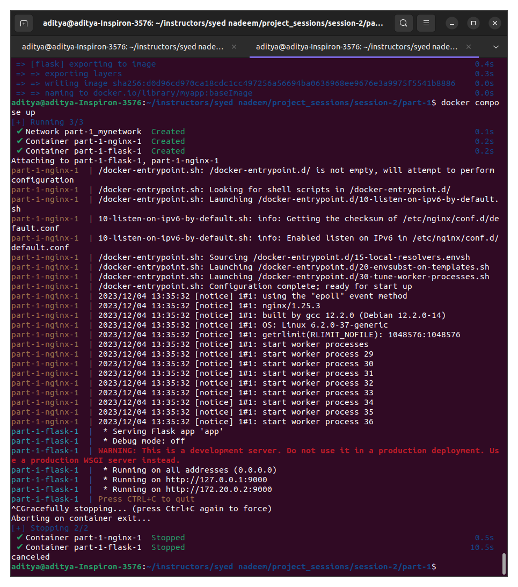

- Now here if I want to build the image I do not need to build them seprately.

- No need to Update them seprately also
  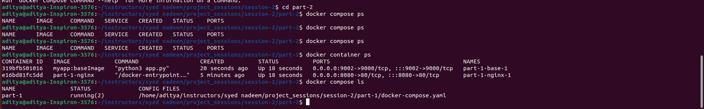

- By default it attaches a name; so we do not need to provide it;
- **_Important:_** Name of the container is the name of the service

- It acts like minfied version of K8's

To stop docker compose

```
docker compose stop
```

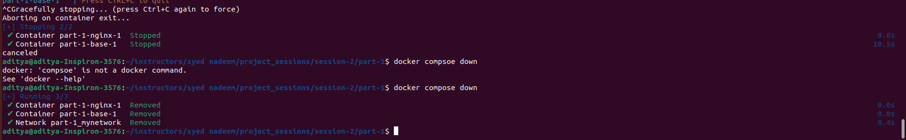

- Another proble with the Docker we had it was with the saling

- So we can scale easily in the Docker Compose like

```
docker-compose up -d --scale <service_name>=2
```

Let us use the scale to 4 containers with the service "base" as in our above example. It will look like

```
docker-compose up -d --scale base=4
```

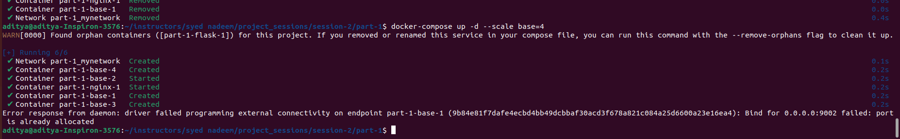

- It will not run as the PORTS will get occupied by the first instance of base; when scaled it will also try to run on the same PORT but as we know the port once allocated cannot be ocupied by other scaled instances.

```
# Stop docker compose

docker-compose stop
```

WE need to make changes in the docker compose.yml file

```
version: '3.2'
networks:
  mynetwork: #network name
    driver: bridge  # type network
services: #warpper on top[ of container]
  base:      # Containers named base
    build:
      context: . #current folder
      dockerfile: Dockerfile.base
    ports:
      - "9002:9000"
    image: myapp:baseImage
    networks:
      - mynetwork
  nginx:     #Container named nginx
    build: ./nginx
    ports:
    - "8080:80"
    networks:
      - mynetwork


      Will be chnaged to

version: '3.2'
networks:
  mynetwork: #network name
    driver: bridge  # type network
services: #warpper on top[ of container]
  base:      # Containers named base
    build:
      context: . #current folder
      dockerfile: Dockerfile.base
    ports:
      - "9000" # remove the local machines port and try to assign it any random port it will only be 9000 then(port of container)
    image: myapp:baseImage
    networks:
      - mynetwork
  nginx:     #Container named nginx
    build: ./nginx
    ports:
    - "8080:80"
    networks:
      - mynetwork
```

Now again try the scale command we will get it as follows

```
docker-compose up -d --scale base=4
```

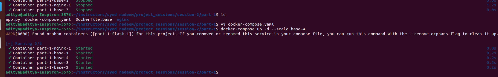
It gets it running

```
docker compose ps
```

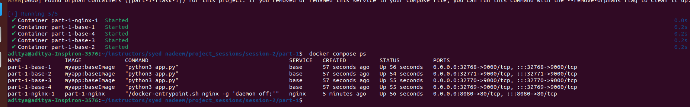

- Resolves scaling Problem

### But here PORT numbers for the containers are given randomly ; so for every docker compose restart our ports will change so it will create a havoc on Network Managers.

- Workaround for that will be just like

```
docker-compose down
```

- Refer the session 2 part 2

- In the docker-compose.yml file it will contain the

```
version: '3.2'
networks:
  mynetwork:
    driver: bridge
services:
  base:
    build:
      context: .
      dockerfile: Dockerfile.base
    ports:
      - "9002:9000" # HARD attaching the ports here
    image: myapp:baseImage
    networks:
      - mynetwork
  multistaged:
    build:
      context: .
      dockerfile: Dockerfile
    ports:
      - "9001:9000" # HARD attaching the ports here
    image: myapp:productionImage
    networks:
      - mynetwork
  multistaged-replica:
    build:
      context: .
      dockerfile: Dockerfile
    ports:
      - "9000:9000" # HARD attaching the ports here
    image: myapp:productionImage
    networks:
      - mynetwork
  nginx:
    build: ./nginx
    ports:
    - "8080:80"
    networks:
      - mynetwork
~
```

In this context of Docker-compose.yml file we hae the HARD scaling enable and **BUT no Auto-scaling is available as we need to remap it at the service.**

```
# Then run
docker compose build
docker compose up
```

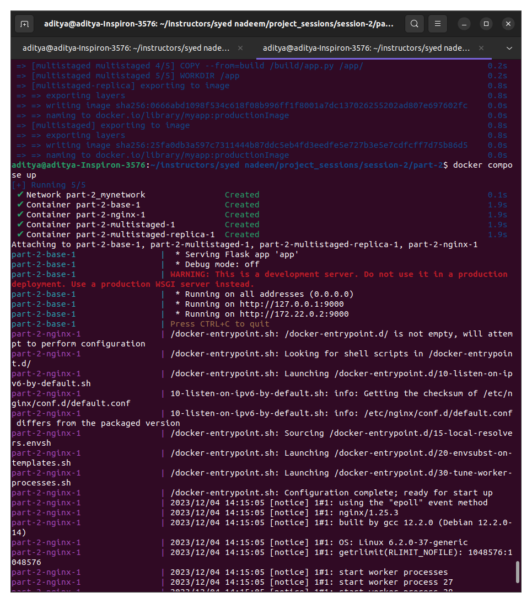

```
docker compose ps
```

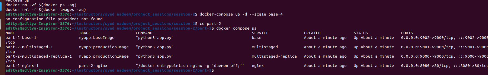

- Now if we change the oort for the base service it should identify the production and the base version.

```
localhost:9000 #PRoduction Version
localhost:9002 #Base Version
```

## Production Version


## Base Version


## But how will Docker Compose managed the Load Balancing ?

- We need tio create our Load Balancer from the scratch.
- For that we have configured our own nginx load balancer and have made changes in the nginx.conf file (By removing the default.conf from the orignal nginx LB)
- Refering the docker file it looks like

```
FROM nginx
RUN rm /etc/nginx/conf.d/default.conf
COPY nginx.conf /etc/nginx/conf.d/default.conf

```

- In the nginx.conf file it will contain

```
upstream loadbalancer {

    server 172.17.0.1:9002 weight=5;
    server 172.17.0.1:9001 weight=5;

    # server 0.0.0.0:56360 weight=4;
    # server 0.0.0.0:56361 weight=3;
    # server 0.0.0.0:56364 weight=3;

}

server {
    location / {
        proxy_pass http://loadbalancer;
    }
}

```

- It actually distributes the load with the load across the servers according to weights.
- We should manage the resposnibility of nginx.conf to make the changes while upscaling or downscaling the containers.
- But it will be difficult to scale in this scenario for dynamically scaling.
- This all will get covered with the help of Kubernetes Dynamic Scaling.

## In Docker Compose; if our container goes donw it will not automatically start the container

- We need to manually do it on our own.

- Docker Compose is the builder of the image; and Kubernetes is the Deployerof the Image.

````
### Important Commands to remember
- If the ports are occupied and want to free the Port we can use
```
sudo lsof -i -P -n | grep <Port number>
kill <process_id>
```

## In production we should not have a image with Privelaged Access; it should pop an error when you try to change it !

## We need to maintain both the images ; we need both the base (unrestricted) image and the production(staged Filtered image) new image to debug here.

- We are going to deploy only the stage and filtered image in the production but to debug a scenarios we will need to have the BASE (Unrestricted image)

## Q. Why Prefer Multistage Builds ?
- Security it provdes with the image is top notch
- Scaling it provides is great
````

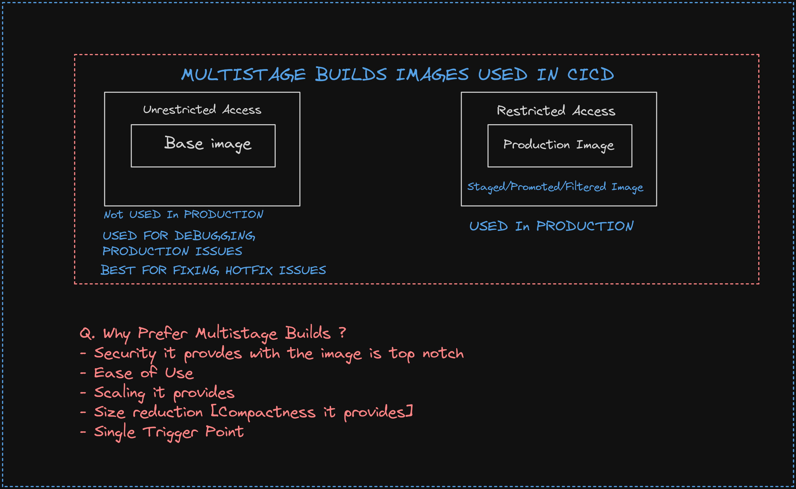
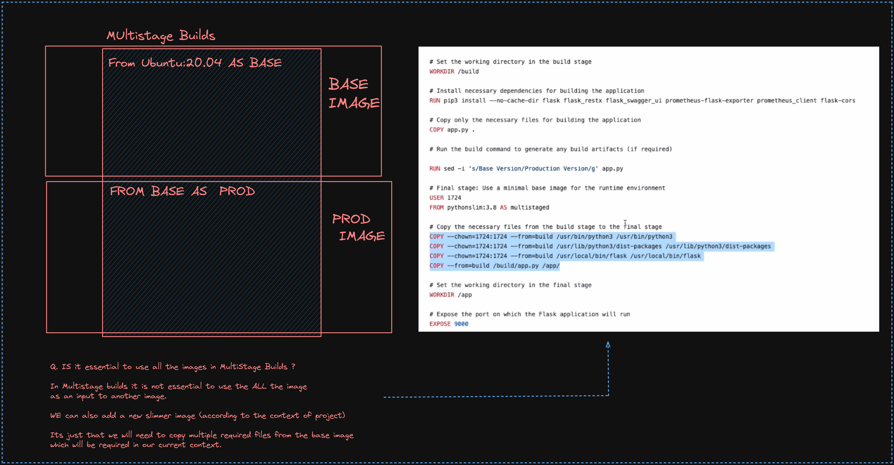
