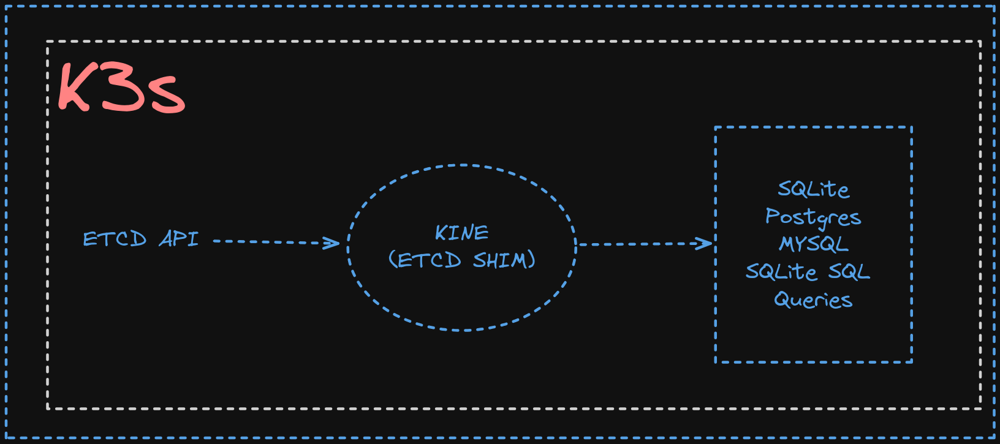

### This are some of the Questions which were Posted by `Syed Nadeem` from his Series `Devops 101`

---

### Q1: Design a Kubernetes deployment setup where you have 3 apps that need to run in HA to create a solution. However, the apps have starting and running dependencies and requirements.

a. app1 should always start first;
b. app2 should always start after app1 is Ready;
c. app3 should always start after app2 is Ready

Follow up:

1. How will you design a check mechanism for the applications in such a way that restarts and schedular reschedules dont break the dependence requirements
2. How will you plan to incorporate such check mechanism with CD tools where deployments are gitops driven

### MY take on the Solution:


#### Approach 1

##### For Part A> Application 1 should always start first

- For each App ==> Have Different "Deployment" configuration

- Need to make use of the K8's "Deployment" Object with `"Probes"` and `"InitContainers"`

- `Probes` => Used to check the status of the containers (Application) running inside the PODs

- `InitContainers` ==> They are the Containers that run before our main application gets started; [InitContainers generally get completed when our "main" application is in the "Pending Phase"]
  
- For this, we will make use of the "Readiness probe" to check if the App inside the container is ready to serve the traffic received via Load balancers and Services

- Checks for health at path "/health" if not "healthy" then after the "initialDelay"; try to monitor the health after every "periodSeconds" defined.

##### For Part B> Application 2 should always start after Application 1 is Ready

- We will make use of the `"Readiness Probe"` and `"init containers"`

- NOTE: But before that, we need to ensure that we have created the "Services" beforehand which will be required by the running Applications

- Services with appropriate configurations like PORTS, and SELECTORS and ensuring they are working as desired.

- In the "Init Containers," we will use the Sandbox Image like "Busybox" to check if the service for App1 exists or not

- NOTE: Init Container will add the internal Dependency in-between the Service for the App1 and App2

- Init Container could create a dependency using commands like "nslookup" OR "ping" until service-1 is reachable; sleep else could execute.


- For app2 deployment file
  

##### For Part C> Application 3 should always start after Application 2 is Ready

- We can plan it similarly as we have done for App 2 which would Span out as follows
  

#### Approach 2: Using Stateful Sets

- We can make use of Stateful Sets as they maintain a certain order of execution of PODS.

- StatefulSets ensures that pods are deployed and scaled in a predictable and ordered manner. Pods are created sequentially, starting with ordinal index 0, which can be crucial for applications with dependencies between instances or for initialization processes that need to run in a specific order.

- StatefulSets provides features for managing the lifecycle of stateful pods, including pod identity, rolling updates, and graceful termination. These features are designed to minimize disruption to stateful applications during updates or maintenance operations.

- We will make use of the stateful state as follows

- For application 1 Stateful Sets
  
- For Application 2 Stateful Sets
  
- For Application 3: Stateful Sets
  

#### DISADVANTAGES of using Deployments

- Complex to maintain the order of Execution

- Requires lots of Configuration

- Probes will consume lots of resources

#### For follow-up question

##### Q. How will you plan to incorporate such a check mechanism with CD tools where deployments are GitOps-driven

- Maintaining via GIT-OPS TOOLS;

- Consider using a different repository for storing all the "Manifest Files"; so that it acts as a single source of truth and using a reconciler mechanism that monitors the repository continuously

- Using the FLUX-CD we could monitor the changes in the repository using "Reconciler"(Kustomize Controller)

## SOME IMPORTANT KUBERNETES COMMANDS

### How to check health of Kubernetes API Endpoint?

```
kubectl get --raw='readyz?verbose'

or

kubectl get --raw='heakthz?verbose'

```

### How to verify service account permissions?

- One of the most common scenarios comes up especially when we are checking the permissions of the certain service accounts
- It cab be done using the

```
kubectl auth can-i create pods --all-namespaces

OR

# can we read the pods logs from it
kubectl auth can-i get pods --subresource=log
```

- It will reply with either `YES` or `NO`; access level of service account is really helpful in the case of the maintining the least privilaged principles.

- If the nessasary services are not added then the `role` can be modified which is bounded to the service account.

### How to get the skeleton of YAML for the various K8's native objects ?

- Using the flag `--dry-run=client` => Such that it wont get created in the cluster

```
kubectl run nginx-pod --image=nginx -o yaml --dry-run=client > nginx-pod.yaml

OR

kubectl create pod nginx-pod --image=nginx --dry-run=client -o yaml
```

### Are there any alternatives for ETCD in Kubernetes ?

- `YES there are`, ETCD is used for Data Persistence of the K8 Cluster.
- We can ue the `MYSQL`, `SQLite` and `Postgres` as a replacement for data Persistence in K8s.
- In fact the `K3's uses it using KINE`
- Kine (Acts as ETCD SHIM) converts the `ETCD API` to `MYSQL, SQLite, Postgres, SQLite SQL Queries`
  

### Can we list K8 API Resources?

- `YES`; Everything in the API can be accessed via the API's; kubectl internally uses the API Commands that are converted from our `HIGH LEVEL inputs` eg (kubectl get pods).
- API Server provides the API Endpoints to manage the resources such as Pods, Namespaces, ConfigMaps, ReplicaSets etc.
- These object-specific endpoints are called 𝗔𝗣𝗜 𝗿𝗲𝘀𝗼𝘂𝗿𝗰𝗲𝘀 𝗼𝗿 𝗿𝗲𝘀𝗼𝘂𝗿𝗰𝗲𝘀.

- For example, the API endpoint used to create a pod is referred to as a 𝗣𝗼𝗱 𝗿𝗲𝘀𝗼𝘂𝗿𝗰𝗲.

- In simpler terms, a resource is a 𝘀𝗽𝗲𝗰𝗶𝗳𝗶𝗰 𝗔𝗣𝗜 𝗨𝗥𝗟 used to access an object, and they can be accessed through HTTP verbs such as GET, POST, and DELETE.

```
kubectl api-resources --verbs=list --no-headers | awk '{print $1}'
```

### Can we add the custom columns in the K8s?

- `YES` we can have the custom column name in the K8s; it acts as `VIEWS` in MYSQl (Just for the ease of the Human readable format).
- Eg > command that gives custom output showing the pod name and CPU & memory requests.

```
kubectl get pod -o custom-columns='POD NAME:.metadata.name,CPU

O/p Will be as

POD NAME                        CPU REQUEST   MEMORY REQUEST

frontend-prod-v1                500m          512Mi
backend-prod-v2                 1             1Gi
database-prod                   2             4Gi
cache-prod                      250m          128Mi
analytics-worker-prod           200m          256Mi
```

- Eg> lists the pod name and volumes used by a pod.

```
kubectl get pod -o custom-columns='POD NAME:.metadata.name, VOLUMES:.spec.volumes[*].name'

O/P will be as follows

POD NAME               VOLUMES
multi-container-pod   nginx-logs,kube-api-access-56rhl
web-app-01            nginx-logs-1,kube-api-access-8nkwn
web-app-02            nginx-logs-2,kube-api-access-68hgd
web-app-04            nginx-logs-2,kube-api-access-5d6xh
```

### Misceallaneous HELP

- **`JSON Objects to Graph Diagrams`**

```
Github Link: https://github.com/AykutSarac/jsoncrack.com
Online at : jsoncrack.com
```

- **`YQ: Handy CLI to Parse YAML`** yq is a lightweight command-line utility to parse YAML, also works with the JSON, XML, LUA, Shell output, and properties files.
- Written in Go; Perfect for those times when you need to tweak files on the fly.
- eg> Pair yq with kustomize to patch values directly into your YAML files.
- Lets try to do a task such as read an image name from an environment variable and add it to the YAML.

- POD.yaml will be containing

```
apiVersion: v1
kind: Pod
metadata:
  name: my-nginx-pod
  labels:
    app: nginx
spec:
  containers:
  - name: nginx
    image: nginx:1.14.2
    ports:
    - containerPort: 80
```

- To get the apiVersion

```
yq eval '.apiVersion' pod.yaml
```

- TO change the image name

```
yq eval -i '.spec.containers[0].image = "nginx:1.18"' pod.yaml
```

- **`How to get Pulic IP of Server`**
- Generally do not consider to use any 3rd party tool for getting this not a standard practice; so we can use our native commands like as follows

```
curl https://checkip.amazonaws.com

OR

curl -s https://api.ipify.org -w "\n"""

OR

curl https://icanhazip.com

OR

curl https://ipinfo.io/ip && echo ""

OR

# FOR AWS MACHINES (Enable SMTP for geting the ping from google.com in the inbound Rules)
curl http://169.254.169.254/latest/meta-data/public-ipv4 && echo ""

```

- `List namespaces in the linux?` => namespaces are used to create the isolation among the processes

```
lsns
```

- **`Check the Shell Script using the "ShellCheck" `**: Its a a powerful static analysis tool for bash/sh shell scripts; provides warnings and suggestions to help you identify and fix potential issues.

- It can be integrated with CI pipelines as linter, ensuring that you shell scripts are bug-free even in the `GitHub Actions`

- **`Utility for Monitoring Data Transfer PIPE UTILITY`**: While performing the data migration for DB Pipe Viewer (pv) utility.
- Pipe viewer, also known as pv, is a terminal-based tool that can be used to monitor the progress of data transfer.

```
pv backup.sql | mysql -h rds.amazonaws.com -u bibinwilson -p my_db

# It gives out features like

Features
- Visual progress bar
– Estimated time remaining
– Latency
```

- **`SSHLog: Monitor SSH Activity`** : tool to monitor SSH Activity.
- SSHLog is an eBPF-based tool written in C++ and Python that passively monitors OpenSSH servers.
- eBPF is a technology that allows programs to be run securely in the Linux kernel using sandboxed programs.

- **`How Does SSHLog Agent Work?`**
- SSHLog uses eBPF to monitor the following events:

```
SSH connections
SSH commands
SSH output
```

- These events are tracked using syscalls like connect, execve, read etc. When an SSH event occurs, SSHLog records the event in a log file.
-
