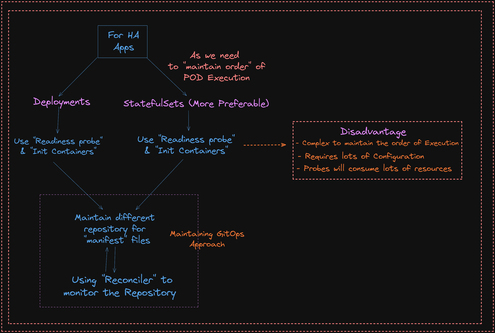
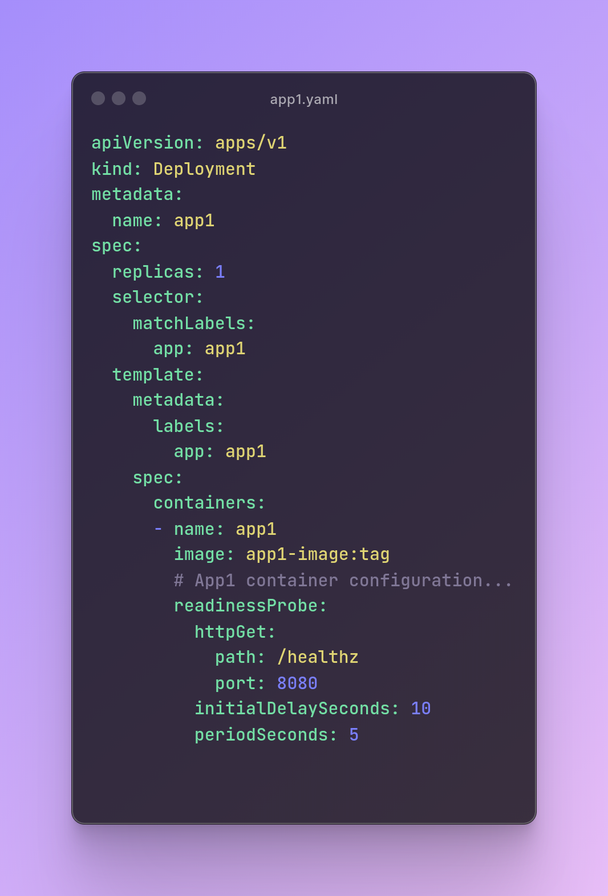
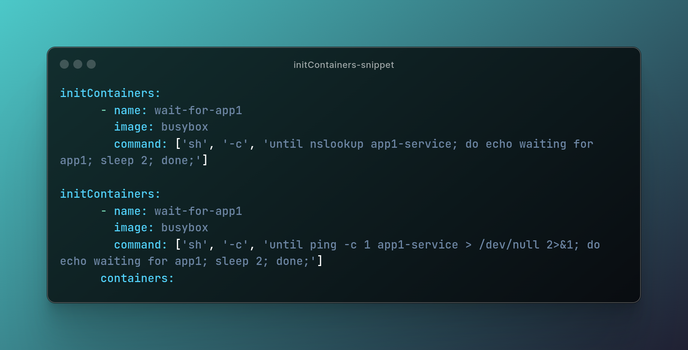
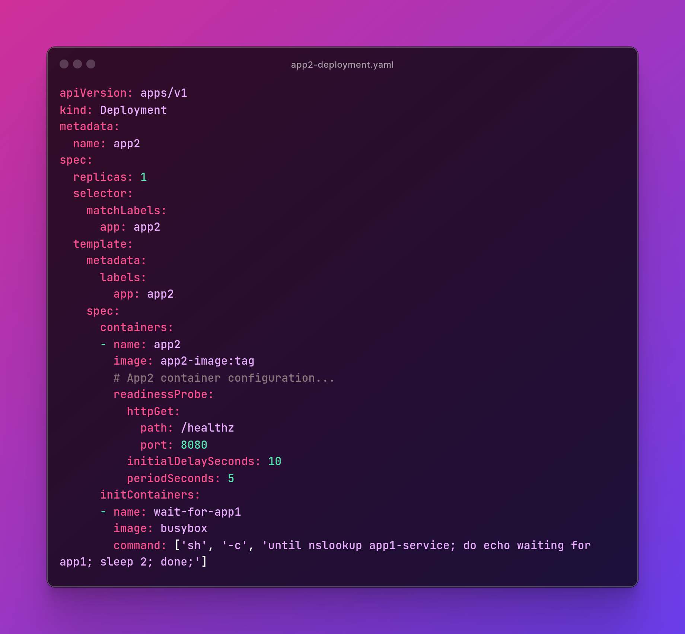
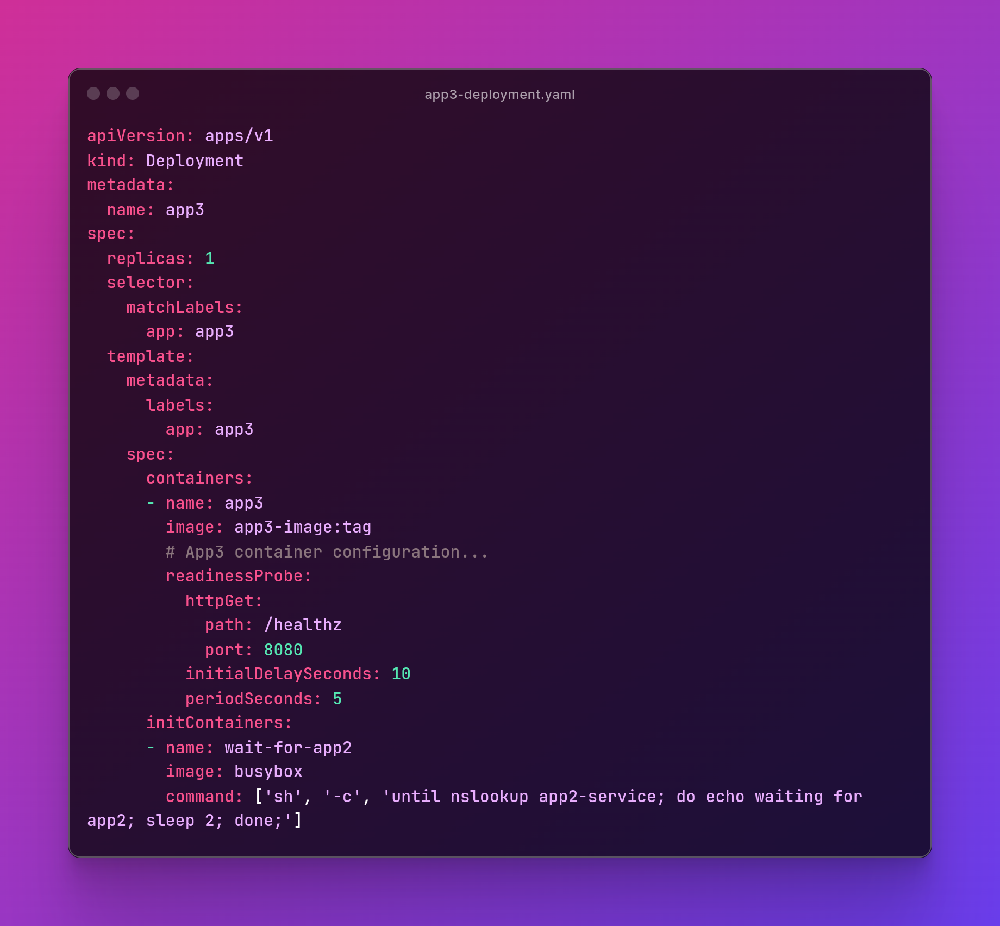
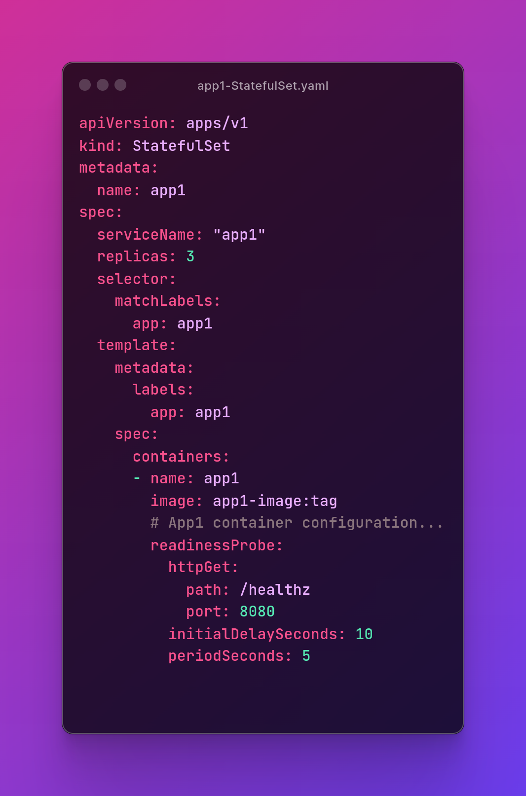
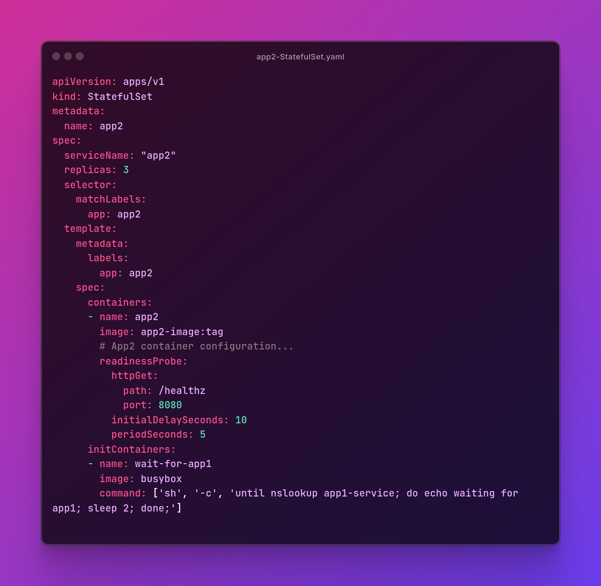
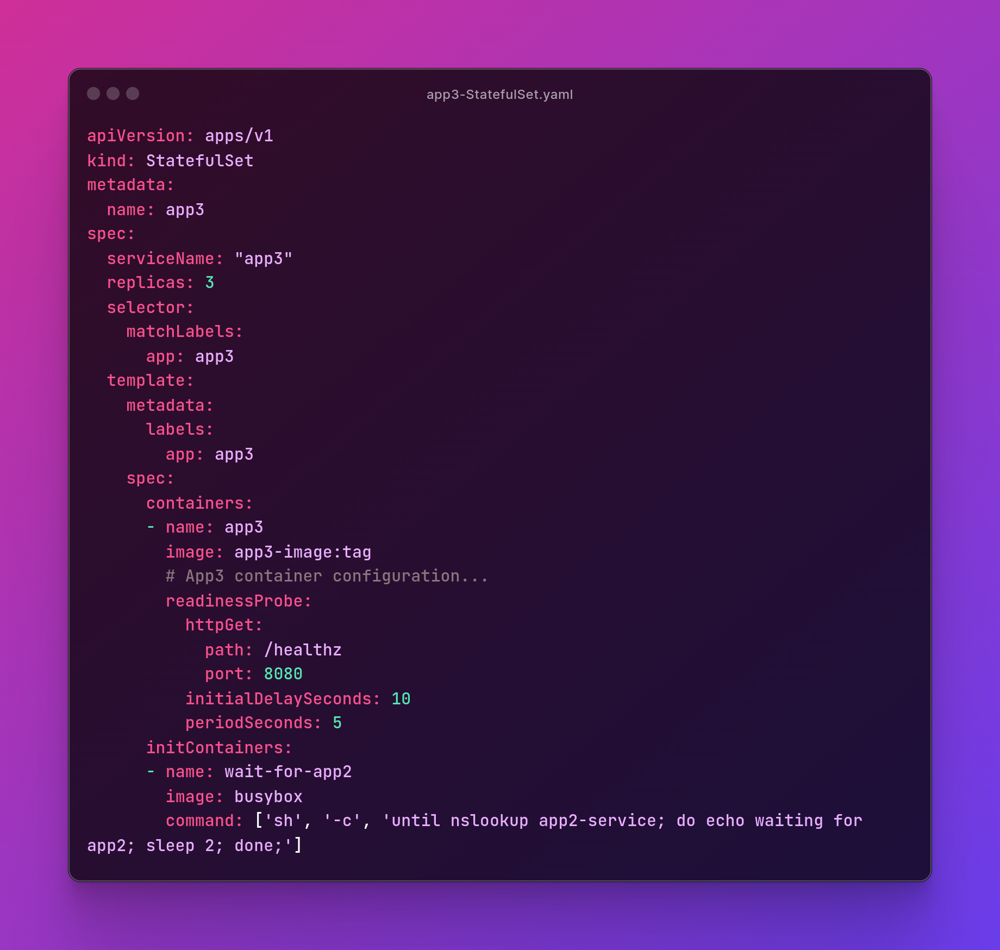

### This are some of the Questions which were Posted by Syed Nadeem from his Series `Devops 101`

---

### Q1: Design a Kubernetes deployment setup where you have 3 apps that need to run in HA to create a solution. However, the apps have starting and running dependencies and requirements.

a. app1 should always start first;
b. app2 should always start after app1 is Ready;
c. app3 should always start after app2 is Ready

Follow up:

1. How will you design a check mechanism for the applications in such a way that restarts and schedular reschedules dont break the dependence requirements
2. How will you plan to incorporate such check mechanism with CD tools where deployments are gitops driven

### MY take on the Solution:

#### Approach 1

##### For Part A> Application 1 should always start first

- For each App ==> Have Different "Deployment" configuration

- Need to make use of the K8's "Deployment" Object with `"Probes"` and `"InitContainers"`

- `Probes` => Used to check the status of the containers (Application) running inside the PODs

- `InitContainers` ==> They are the Containers that run before our main application gets started; [InitContainers generally get completed when our "main" application is in the "Pending Phase"]
  
- For this, we will make use of the "Readiness probe" to check if the App inside the container is ready to serve the traffic received via Load balancers and Services

- Checks for health at path "/health" if not "healthy" then after the "initialDelay"; try to monitor the health after every "periodSeconds" defined.

##### For Part B> Application 2 should always start after Application 1 is Ready

- We will make use of the `"Readiness Probe"` and `"init containers"`

- NOTE: But before that, we need to ensure that we have created the "Services" beforehand which will be required by the running Applications

- Services with appropriate configurations like PORTS, and SELECTORS and ensuring they are working as desired.

- In the "Init Containers," we will use the Sandbox Image like "Busybox" to check if the service for App1 exists or not

- NOTE: Init Container will add the internal Dependency in-between the Service for the App1 and App2

- Init Container could create a dependency using commands like "nslookup" OR "ping" until service-1 is reachable; sleep else could execute.

- For app2 deployment file
  

##### For Part C> Application 3 should always start after Application 2 is Ready

- We can plan it similarly as we have done for App 2 which would Span out as follows
  

#### Approach 2: Using Stateful Sets

- We can make use of Stateful Sets as they maintain a certain order of execution of PODS.

- StatefulSets ensures that pods are deployed and scaled in a predictable and ordered manner. Pods are created sequentially, starting with ordinal index 0, which can be crucial for applications with dependencies between instances or for initialization processes that need to run in a specific order.

- StatefulSets provides features for managing the lifecycle of stateful pods, including pod identity, rolling updates, and graceful termination. These features are designed to minimize disruption to stateful applications during updates or maintenance operations.

- We will make use of the stateful state as follows

- For application 1 Stateful Sets
  
- For Application 2 Stateful Sets
  
- For Application 3: Stateful Sets
  

#### DISADVANTAGES of using Deployments

- Complex to maintain the order of Execution

- Requires lots of Configuration

- Probes will consume lots of resources

#### For follow-up question

##### Q. How will you plan to incorporate such a check mechanism with CD tools where deployments are GitOps-driven

- Maintaining via GIT-OPS TOOLS;

- Consider using a different repository for storing all the "Manifest Files"; so that it acts as a single source of truth and using a reconciler mechanism that monitors the repository continuously

- Using the FLUX-CD we could monitor the changes in the repository using "Reconciler"(Kustomize Controller)
