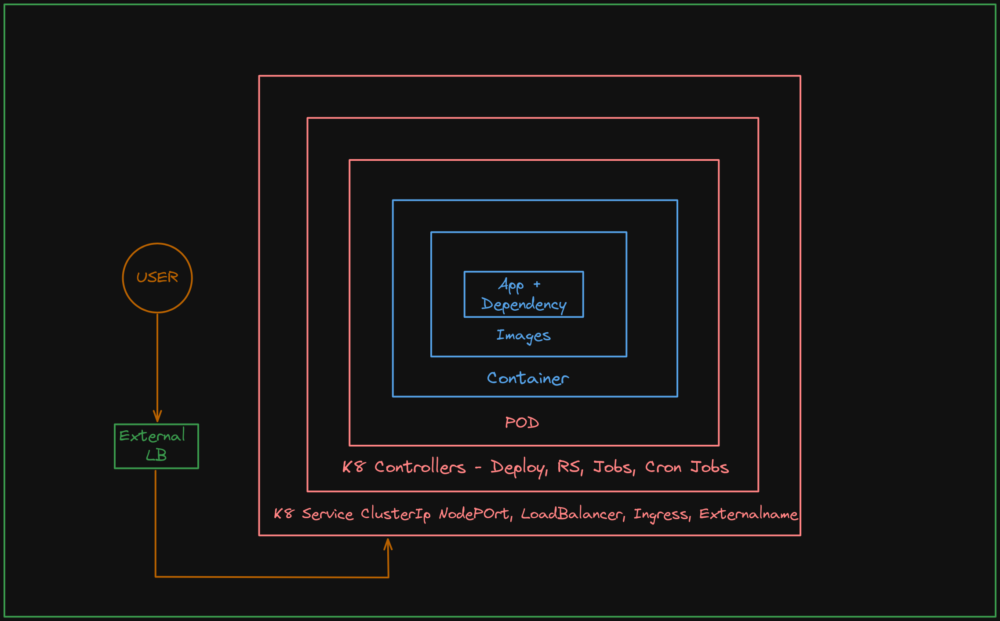
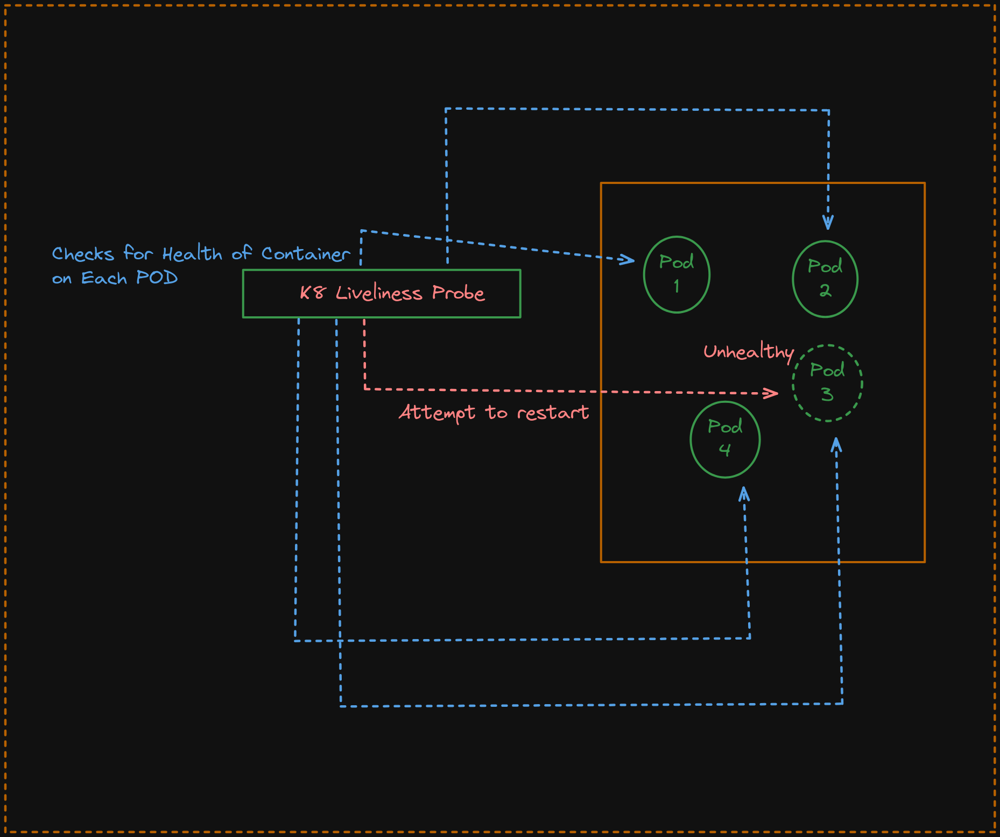
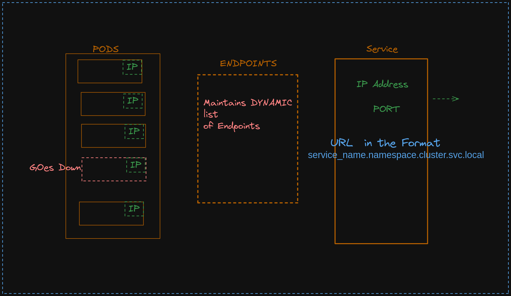
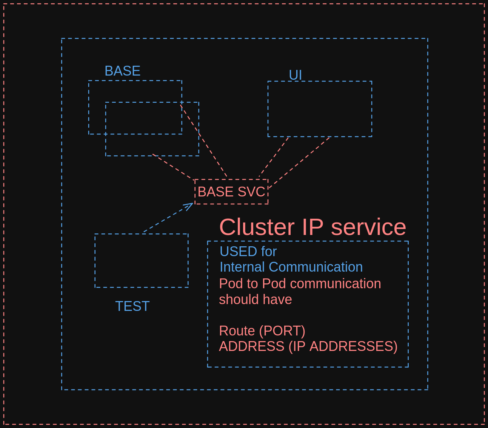
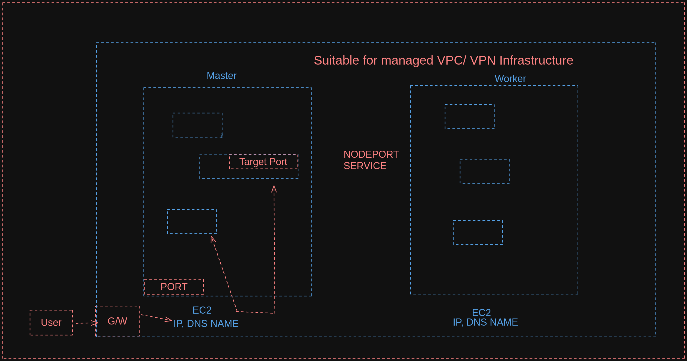
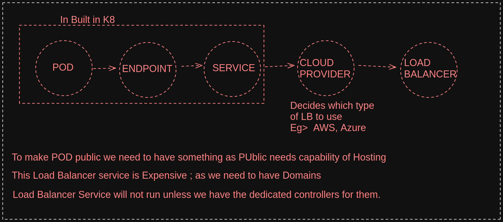
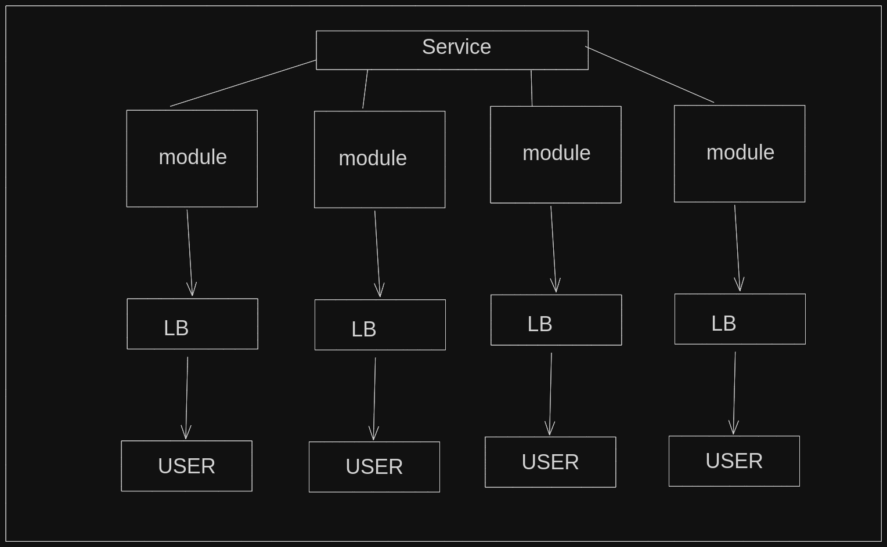
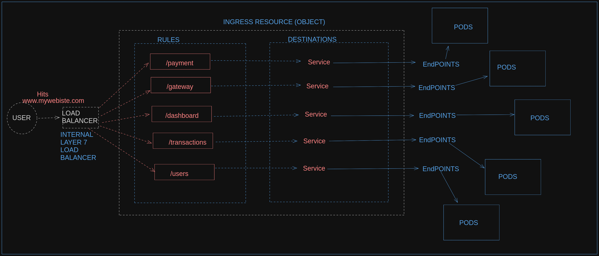

# Kubernetes Trivia

## WHy go with K8 rather than Docker Compose ?

- In Docker Compose; if our container goes down it will not automatically start the container
- We need to configure our own load balancer mechanism in the compose whereas it is handled very easily in the Kubernetes Services of Load Balancer.
- Docker Compose we need to manage the scaling manually but in Kubernetes, we can manage it by using the controllers(replicaset) for that matter.
- DNS mapping not available by default in Compose
- K8 easily manages the Current vs Desired state with the help of Controllers that were not featured in the Compose.

## K8's basics

- This is how our application lies
  

- The main purpose of `K8 is to expose our PODS to the external workladd with best security practices possible`
- The granular control of K8's comes from the POD (smallest level that we can control in K8s)
- Pod can contain one or multiple containers. [Preferred is one container in one pod.]
- [NOTE] Pod if goes down cannot restart on its own it needs the help of controllers to get them restarted.
- `Controllers` are the ones who take the responsibility of maintaining the POD's.
- Whenever the external user wants to connect to our Pod it can connect via the K8's services like
  - a> ClusterIp( Default; For internal Communication of Pods),
  - b> NodePort (Preferred for Communication within the same VPC).
  - c> LoadBalancer (Depends on the Cloud Provider for the External Communication)
  - d> Ingress (Most widely used in the Industry; it maintains a route table inside it for the path based routing)
  - e> External Name (Newly introduced not widely used)

## Some commands

```
alias k="kubectl" # alias k as kubectl

k get pods / k get po # get pods

k desrcibe po <pod name> # To get more details about the PODS

k edit po <pod name> # To edit the details of the PODS

# Create the pod named as "nginx-pod" with the image as "nginx" getting our o/p in yaml format and dry running our code (it will not create the pod it will show what will be the content of the pod if it gets created)

k run nginx-pod --image=nginx -o yaml --dry-run=client

k create pod nginx-pod --image=nginx -o yamkl --dry-run=client

# To get all the api-resources (from here we can retrieve the short names)
k api-resources

#It gives us IP important in the context of Kubernetes
k get po - o wide

```

---

### Status of POD

- Pending - (The pod has been accepted by the Kubernetes system, but one or more of its containers are not yet running.)
- Running - (All containers in the pod are up and running.)
- Succeeded - (All containers in the pod have successfully terminated, and won't be restarted.)
- Failed - ( All containers in the pod have terminated, and at least one container has terminated in failure.)
- Unknown - (The state of the pod could not be determined.)

---

### What is Probe in context to K8?

- Probes are mechanisms to check the status and health of the container within the POD
- Used for improving the reliability and resilience of the application.
- Probes are generally identified into two types they are

  - `Liveliness Probe` -

    - **Purpose**: This is to check the application within the container is alive and healthy also checks if it is functioning as expected.
    - **Working**: Kubernetes actually periodically executes the commands or HTTP requests defined in the POD Specification. If the probe succeeds then the container is considered healthy if not (the application is considered in a bad state). Kubernetes restarts the container in an attempt to recover it

    ```
    livenessProbe:
      httpGet:
        path: /healthz
        port: 8080
      initialDelaySeconds: 3
      periodSeconds: 3

    ```

  - `Readiness Probe` -

    - **Purpose**: The readiness probe is used to determine if a container is ready to accept incoming network traffic. It signals whether the container is in a state to serve requests.
    - **Working**: Similar to the liveness probe, the readiness probe executes a command or HTTP request at specified intervals. If the probe succeeds, the container is considered ready to receive traffic. If it fails, the container is marked as not ready, and it is removed from the service's load balancer until it becomes ready again.

    ```
    readinessProbe:
      httpGet:
        path: /ready
        port: 8080
      initialDelaySeconds: 5
      periodSeconds: 5
    ```



-

### Why are some resources in the API Version set as v1 and apps/v1 ?

- The use of different API versions often signifies the evolution and changes in the Kubernetes API. When Kubernetes introduces new features, it may include those features in a new API version to maintain backward compatibility with existing resources.
- The API version indicates the format of the resource definition and the set of fields it supports.
- `apps/v1` - It represents especially those related to certain higher-level controllers and objects, might use a different API version
- `v1` - v1 API version often refers to core Kubernetes resources, such as Pods, Services, and ConfigMaps.
- It's important to note that Kubernetes continues to evolve, and new API versions may be introduced to accommodate changes and improvements in the platform.

---

### What are services in K8?

- Service is a way that provides an endpoint of PODs.
- Service provides the `service discovery` to the PODS
- The Pods can be easily identified with the help of selector `labels` in the PODs which helps in grouping the PODs.
  - `Service Discovery` - identify the PODs without having to remember its IP with the concept of Namespace
  - eg. service.namespace.cluster.svc.local becomes like the Doman name.
- Even if pods restart then it can easily identify the pods with the selector labels and URL in this format `service.namespace.cluster.svc.local`
- Services are classified into multiple types
  - a> ClusterIp( Default; For internal Communication of Pods),
  - b> NodePort (Preferred for Communication within the same VPC).
  - c> LoadBalancer (Depends on the Cloud Provider for the External Communication)
  - d> Ingress (Most widely used in the Industry; it maintains a route table inside it for the path based routing)
  - e> External Name (Newly introduced not widely used)

---

### What are the Endpoints in K8s?

- Endpoints associate POD's to the services.

- Pods have IP addresses
- Service has an Ip address and a PORT
- Also service gets and URL like service_name.namespace.cluster.service.local. This service_name and namespace will keep on changing.
- eg> my-app.default.cluster.svc.local

- If a pod goes down then it should be updated in Loadbalancer; so LB should not route the traffic to the pod which is down. Who would manage that? (Service does not do that)
- Service jobs is to identify what traffic is coming in and what endpoints need to mention.

- Somebody in the middle is responsible for a one-to-one mapping of the list of endpoints; This component is called `Endpoints`.
- It is similar to nginx.config folder.
- **[NOTE]** We do not need to explicitly create the Endpoint (auto-created) as we have done for service and deployments.
- Whenever a new pod is added the entry will be added to the table and if pod gets down then the entry in the table also gets deleted.
  

- As a user, we will hit the service<svc> on the service URL which internally translates to the IP Address of the service (Service Discovery) and looks for Endpoints.

- Service Endpoint also acts as a Controller.
- Endpoints are system-created as opposed to services, deployments, etc.
- **[NOTE]** Pod mapping is done with the help of Endpoint and not the Service.

```
# To get the list of Endpoints
kubectl get endpoints

kubectl get ep
```

---

### DNS vs Service Discovery

| Feature            | DNS (Domain Name System)                                                                          | Service Discovery                                                                                                    |
| ------------------ | ------------------------------------------------------------------------------------------------- | -------------------------------------------------------------------------------------------------------------------- |
| **Purpose**        | Translates domain names to IP addresses and vice versa.                                           | Allows dynamic discovery of services in a network.                                                                   |
| **Functionality**  | Resolves domain names to IP addresses. Provides a decentralized naming system.                    | Enables services to register their availability and discover the location of other services dynamically.             |
| **Use Cases**      | Mainly used for host name resolution on the internet.                                             | Crucial in distributed systems, microservices architectures, and dynamic computing environments.                     |
| **Dynamic Nature** | Typically static mappings that change infrequently.                                               | Dynamic registration and discovery of services to accommodate changes in the network or system.                      |
| **Communication**  | Provides a way for humans to access resources using human-readable names.                         | Facilitates communication between services within a network, allowing them to discover and interact with each other. |
| **Examples**       | Translates www.example.com to an IP address.                                                      | Allows a service to discover the location (IP address and port) of another service in a microservices architecture.  |
| **Dependency**     | Often used as the initial step in service discovery to resolve initial hostnames to IP addresses. | Relies on DNS for name resolution in some cases.                                                                     |

---

### Endpoints vs Services

| Feature               | Endpoints (Kubernetes)                                                                       | Services (Kubernetes)                                                                                    |
| --------------------- | -------------------------------------------------------------------------------------------- | -------------------------------------------------------------------------------------------------------- |
| **Definition**        | A set of backend Pods exposed through a Service.                                             | An abstraction that defines a logical set of Pods and a policy by which to access them.                  |
| **Scope**             | Represents individual Pods providing the actual application functionality.                   | Represents a higher-level abstraction that groups multiple Pods and provides a stable network endpoint.  |
| **Functionality**     | Directly corresponds to backend application functionality, often specific to a microservice. | Acts as a stable virtual IP and port that can route traffic to one or more Pods.                         |
| **Granularity**       | Fine-grained, dealing with individual Pod instances.                                         | Coarse-grained, dealing with a group of related Pods.                                                    |
| **Usage**             | Provides a direct interface to the functionality of a single Pod or set of similar Pods.     | Offers a single entry point for accessing multiple Pods, providing load balancing and service discovery. |
| **Example**           | `my-app-pod-1`, `my-app-pod-2`                                                               | `my-app-service`                                                                                         |
| **Dependency**        | Associated with a specific workload, typically a Pod or set of similar Pods.                 | Represents a higher-level abstraction that may depend on one or more Pods.                               |
| **Scalability**       | Scaling is done at the Pod level to handle increased demand for specific functionalities.    | Scaling involves replicating Pods and maintaining service availability and load balancing.               |
| **Relationship**      | Directly associated with the backend implementation of a specific functionality.             | Acts as an abstraction layer, decoupling consumers from the specifics of Pod implementations.            |
| **Abstraction Level** | Low-level, dealing with individual Pod instances and their network accessibility.            | Higher-level, providing a stable and abstracted entry point to access related Pods.                      |
|                       |

---

### What happens if we delete the ALL pods which are linked to a service ?

- Service will not tell us that it is broken.
- We have to manually scavenge the Endpoints in the endpoints;
- The endpoint will show us none in the Endpoints if the Pods are not available.

---

### What are Controllers?

- Whenever a manual effort gets automated in a way that the system is taking care of Operation it is known as Controller.

---

### POD TO POD Communication

- For POD to POD communication we need to have the `Route(Permission)` and `Address(IP)` need to have the Route as well as the address.
- Now Address can be of 2 types ==> Private and Public Address
- In the earlier setup we have managed to keep it in the CNI Range of the Flannel i.e. the Private IP Range.
- If an external user wants to connect to the private IP range it **CANNOT** connect to it as private ip ranges are not accessible outside the cluster.
- As the private IPs are not resolvable; they can resolve only by Gateway of the Infrastructure which will connect to the Nodes > Pods > Application. eg> of Private IP Range (10.10.9.8)
-

### Types of Services in K8

`ClusterIP` -

- It is the default service type
- Used for internal communication of the PODs
  
- They can connect just via localhost:port

---

`NodePort`

- The simplest way to expose the application to the outside world.
- It is used to connect the external user to the Nodes ==> then to the PODs
- It would need a gateway to communicate with the Nodes and then it connects to the Nodes via IP Address / DNS Names via and then to the PODs.
- Expose the service to the external world by using IP or the DNS to the external world.

`Terminologies to understand in NodePort`

- `Target Port` is the PORT of the PODS
- `PORT` is the Port of the Node from where the external user needs to connect
- It is best suitable for Managed VPC or VPN managed Infrastructure.
- 

---

`Load Balancer`

- When having Load balancer Service of 3rd party Cloud Provided Component is needed here.
- It will associate with the POD and the Cloud Vendor[MOST NEEDED].
- To make POD public we need to have something as PUblic needs the capability of Hosting.
- This Load Balancer service is Expensive; as we need to have Domains.
- Load Balancer Service will not run unless we have the dedicated controllers for them.
  

---

### Why go with Ingress?

- For every module we can have a load balancer associated with it.
- This will be a pretty expensive affair to manage LB for each module and also we will need the service for each module.
  

---

`Ingress`

- Most widely used and popular among all the K8 Services.
- It is also a paid service (but a workaround to add our IP in the host folder)
- In Ingress, we maintain a table consisting of the Rules and Destinations in an Ingress Resource.
- Entire traffic will be routed by the Rules present in the Ingress Resources where to navigate further.

- K8 does not come with the default installation of Ingress Controllers
- Nginx Controller is a flavor of Ingress Controllers.
- Ingress gives an idea about what is happening inside the cluster.



---

### LAYER 7 vs Layer 4 Routing?

`Layer 7`

- Layer 7 is the application layer in the OSI model
- When traffic can the Route at Layer 7 then it hits at Application layer known as App Layer Routing
- Layer 7 is based on the ` path-based routing`
- Layer 7 has the affinity towards the API Endpoints aka Layer7 understands what the Endpoints actually are and routes according to the API endpoints.

`Layer 4`

- It is network Layer Routing.
- Layer 4-based routing is performed on the basis of the IP Addresses; it cannot understand the path-based routing.
- As there is no concept of application in the Layer4

