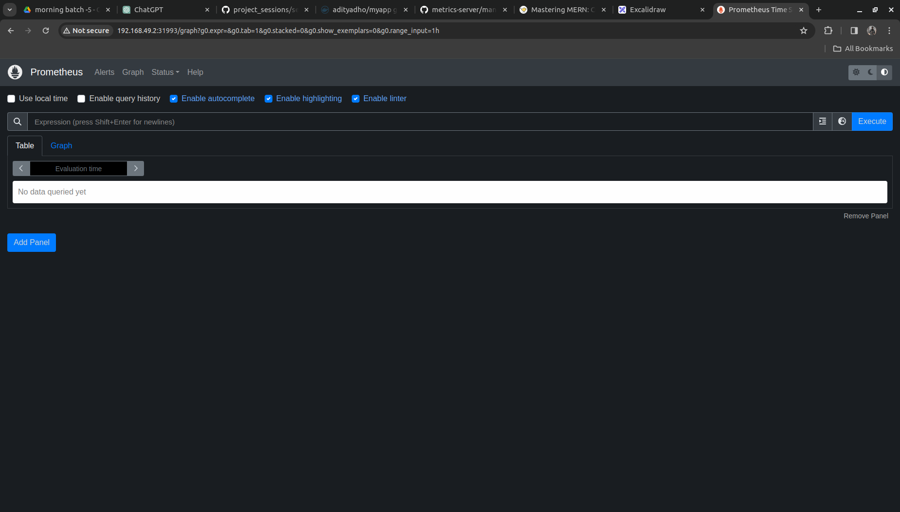
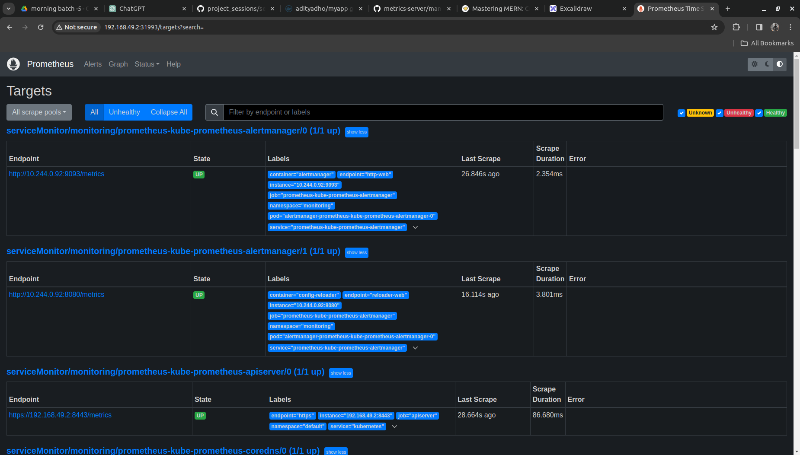
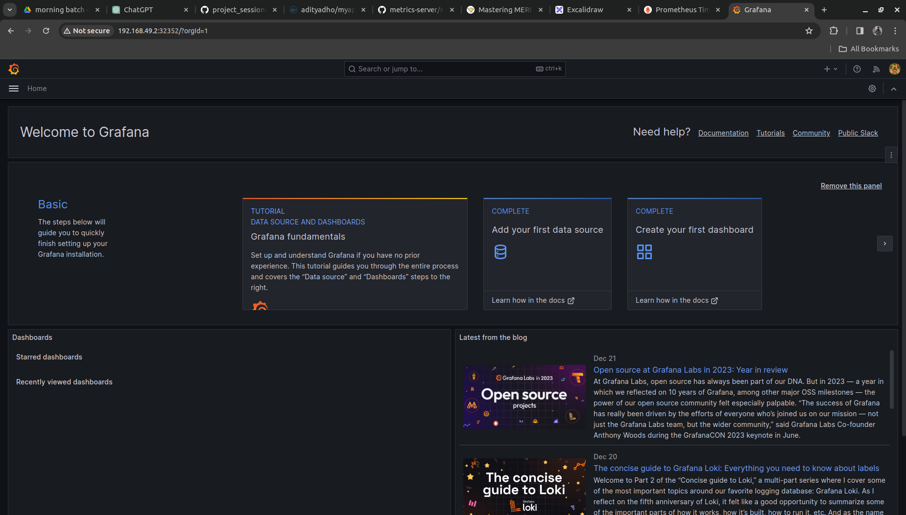
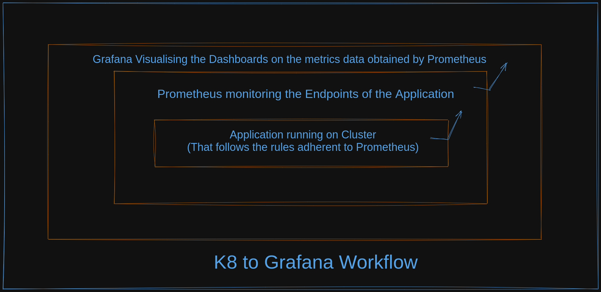

## Monitoring

## HELM

- Helm is a package manager for Kubernetes applications

- The Kubeernetes Resources and the Articatory resources; we can package or bundle it using the `HELM`

- It streamlines the process of installing, upgrading, and managing applications deployed on Kubernetes clusters.

- Helm uses charts, which are packages of pre-configured Kubernetes resources, to simplify the deployment and management of complex applications.

### HELM CHARTS

- A chart is a package of pre-configured Kubernetes resources that can be easily deployed.
- It includes YAML manifests describing Kubernetes resources (such as deployments, services, and ingress) and customizable templates for these resources.
- Charts can be versioned and shared, making it easy to distribute and reuse configurations for applications.

### HELM CLI

- Helm provides a command-line interface (CLI) for interacting with charts and managing Kubernetes applications.
- Developers and operators use the Helm CLI to create, package, install, upgrade, and uninstall charts.

### HELM REPOSITORY

- Helm charts can be stored in a repository, making it easy to share and distribute charts across teams and organizations.
- Helm supports both public and private chart repositories.

### HELM Tiller (Deprecated in Helm 3):

- Tiller was the server-side component of Helm in Helm 2. It interacted with the Kubernetes API server to manage releases.

- In Helm 3, Tiller has been deprecated, and Helm now interacts directly with the Kubernetes API server. This improves security and simplifies Helm's architecture.

---

## Helm Workflow:

### 1. Install Helm:

Install the Helm CLI on your local machine. Helm is available for Linux, macOS, and Windows.

### 2.Create a Chart:

Create a Helm chart to define the structure and configuration of your application.

### 3.Package the Chart:

Package the chart into a compressed archive (.tgz file).

### 4.Install the Chart:

Install the chart on a Kubernetes cluster using the Helm CLI.
Helm will create a release, which is an instance of a chart running on the cluster.

### 5.Upgrade and Rollback:

Use Helm to upgrade or rollback releases as needed. This allows you to make changes to your application's configuration or deploy new versions.

### 6.Explore Helm Repositories:

Explore public or private Helm repositories to discover and use charts created by others.

---

## Helm 3:

Helm 3, the latest version of Helm, introduced several improvements and changes, including the removal of Tiller. In Helm 3, Helm directly interacts with the Kubernetes API server, enhancing security and simplifying Helm's architecture.

To get started with Helm 3, you can use the following commands:

```
# Initialize Helm (one-time setup)
helm init --upgrade

# Create a new Helm chart
helm create mychart

# Install a chart
helm install my-release ./mychart

# Upgrade a release
helm upgrade my-release ./mychart

# Uninstall a release
helm uninstall my-release

```

- Helm is widely used in the Kubernetes ecosystem to manage the deployment and lifecycle of applications, making it easier to package, version, and share Kubernetes configurations.

### Installing Helm

```
https://helm.sh/docs/intro/install/
```

### Install monitoring components using helm

```
# Create a Namespace "monitoring"
kubectl create namespace monitoring

# Download the repo for prometheus
helm repo add prometheus-community https://prometheus-community.github.io/helm-charts

# Update the Repo
helm repo update

# To list the Charts in all namespaces
helm ls -A

# Install Prometheus from the Charts
helm install prometheus prometheus-community/kube-prometheus-stack -n monitoring

## Gives us the output like
NAME: prometheus
LAST DEPLOYED: Fri Dec 22 13:55:57 2023
NAMESPACE: monitoring
STATUS: deployed
REVISION: 1
NOTES:
kube-prometheus-stack has been installed. Check its status by running:
  kubectl --namespace monitoring get pods -l "release=prometheus"

Visit https://github.com/prometheus-operator/kube-prometheus for instructions on how to create & configure Alertmanager and Prometheus instances using the Operator.

## Switch the namespace to `monitoring` [Refer to kubens installation below]
kubens monitoring

## Chekout pods in monitoring namespaces
kubectl get pods


## Gives out the response as
NAME                                                     READY   STATUS    RESTARTS   AGE
alertmanager-prometheus-kube-prometheus-alertmanager-0   2/2     Running   0          9m57s
prometheus-grafana-ff7876654-rqxrs                       3/3     Running   0          10m
prometheus-kube-prometheus-operator-5f84b5dc75-2qkjh     1/1     Running   0          10m
prometheus-kube-state-metrics-6bbff75769-shznd           1/1     Running   0          10m
prometheus-prometheus-kube-prometheus-prometheus-0       2/2     Running   0          9m57s
prometheus-prometheus-node-exporter-q5xd8                1/1     Running   0          10m


## It not only creates the Pods but also other type of resources like deloyments etc within itself like replicaset, deployments, daemonsets etc

## We will expose our services for the Prometheues and Grafana
kubectl expose service prometheus-grafana --type=NodePort --name=grafana-lb --port=3000 --target-port=3000 -n monitoring
kubectl expose service prometheus-kube-prometheus-prometheus --type=NodePort --name=prometheus-lb  -n monitoring

## Observe the services
kubectl get svc

## O/p as
NAME                                      TYPE        CLUSTER-IP       EXTERNAL-IP   PORT(S)                         AGE
grafana-lb                                NodePort    10.108.102.55    <none>        3000:32352/TCP                  18s
prometheus-lb                             NodePort    10.110.87.71     <none>        9090:31993/TCP,8080:31641/TCP   18s

```

- Prometheus is running on the `31993` as we have not provided it the `NODE PORT` it randomly choose it from the `30000 - 32767`
- Access it on browser using Minikube IP

```
# TO access the minikube IP
minikube ip

#GIves out the IP
192.168.49.2
```

### TO access the Promethues Dashboard in the Browser

```
# MINIKUBE IP: NODE_PORT
192.168.49.2:31993
```

### It will give out the Prometheus Dashboard



- It is a 3rd Factory Product which is provided by some engineers and wee are using and releasing it; such softwares are called as `OPEN SOURCE`
- Prometheus does NOT monitors the service/pods
- Prometheus only monitors the `Endpoints`; we can have 1 different pods but prometheus will monitor only the endpoints.
- For the Application to be monitored by Prometheus there needs to be certain rules which needs to be followed by the Application

```
# Lets monitor the enpoints for the HPA then it will acts as
kubectl get hpa -n default

# Whenever the deployment scales then PODS increases and all entries are maintained in the Endpoints; Prometheus monitoring the endpoints will also get the updated entries of the POD; we can monitor it in the Prometheus as well
kubectl get hpa -n default
kubectl get ep -n default

NAME                       ENDPOINTS           AGE
myapp-production-service   10.244.0.66:9000    9d

```

- In the Status Dropdown => Targets we will get our Enpoints that are observed in the Prometheus.
  

### RUNNING GRAFANA DASHBOARD IN BROWSER

- It will be same as that of the Promethus steps
- Get the NODEPORT from the service

```
kubectl get svc grafana-lb -n monitoring
```

- We will be getting it as

```
NAME         TYPE       CLUSTER-IP      EXTERNAL-IP   PORT(S)          AGE
grafana-lb   NodePort   10.108.102.55   <none>        3000:32352/TCP   29m
```

- The Grafana Dashboard will run on the PORT `32352` aand can access it using the `MinikubeIP`
- Access it in browser using the

```
# minikubeip:NODEPORT
192.168.49.2:32352

```

- It will pop the Grafana Dashboard
- Login with the creadentials like

```
username: admin
password: prom-operator / admin
```

- The Dashboard will look as follows
  

- Grafana acts as another layer that acts on Prometheus

- The flow will work as
  Application running on K8's Cluster => Prometheus monitoring the Cluster [Application that follows the rules(adherent to the rules); can only be monitored by Prometheus] => Grafana works on top of Prometheus
- This can be illustrated as follows
  
- For Alerting we have some other layers like `OpsGenie` => responsible for getting automated the calls ; so DevOps folks can do `oncall chnages`

- Remember the Flow from Automated Calls to K8's Endpoints

- Automated Calls[Oncall] => Dashboard of Grafana ==> Made using Prometheus metrics ==> Gets data from Endpoints ==> Endpoint is being monitored by Prometheus

- The Dashboard we can have monitoring tabs on PODS, DEPLOYMENTS etc on various other resources.
- The K8's Infrastructure and the Underlying Application will require some integrations os as to get the application metrics in the prometheus.
- The required Integrations are `Prometheus Object` and `Service Monitoring Object[SMO]`
- The `Promethues Object is taken care by the Helm`(Helm ensures that the promethues object is made when pulling the repo)
- `Promtheus Object` Creation is a one time task
- The `Service Monitoring Object` needs to be created by us for underlying application.
- In the `SMO` Object we need to define the POD and the ENDPOINT(PORT)
- SMO Object can keep on increasing for the UI, App-layer, DB, Nginx
- We have it present under the file named `smon.yaml`

- Contents of which are as follows

```
apiVersion: monitoring.coreos.com/v1
kind: ServiceMonitor
metadata:
  labels:
  name: myapp-production
  namespace: default
spec:
  endpoints:
  - interval: 30s
    port: web
  selector:
    matchLabels:
      app: myapp-production
```

### Decipher the ServiceMonitor Yaml file

- In the context of Kubernetes monitoring, a `ServiceMonitor` is an object used by Prometheus to define **how it should monitor a specific service.**
- This YAML file contains configuration details for Prometheus to scrape metrics from a service named `myapp-production` in the `default` namespace.
- `spec`: Contains the specification or configuration for the ServiceMonitor.

- `endpoints`: Defines the endpoints that Prometheus should scrape metrics from.

- `interval`: Specifies the interval at which Prometheus should scrape metrics from the specified endpoint. In this case, it's set to 30s.

- `port`: Specifies the service port from which Prometheus should scrape metrics. In this example, it's named web.

- `selector`: Specifies the selector to identify the target service.

- `matchLabels`: Specifies the labels that Prometheus should use to identify the target service. In this example, it's looking for a service with the label app: myapp-production.

- Apply the smon.yaml file

```
kubectl apply -f smon.yaml

## Get the SMO object

kubectl get smon -n default
```

### WORKAROUND TO get only our resources ENDPOINTS AND SERVICE DISCOVERY IN PROMETHEUS

- This will break the `Grafana`
- Switch to the monitoring namespace

```
kubens monitoring
```

- Get the Prometheus Object and Edit the Details

```
kubectl edit prometheus prometheus-kube-prometheus-prometheus
```

- Replace the following snippet

```
### replace the following code
  serviceMonitorNamespaceSelector: {}
  serviceMonitorSelector:
    matchLabels:
      release: prometheus

### With the following code
  serviceMonitorNamespaceSelector:
    matchLabels:
      kubernetes.io/metadata.name: default
  serviceMonitorSelector: {}

### Restart the prometheus-kube-prometheus-prometheus
kubectl get pods

kubectl delete pods prometheus-kube-prometheus-operator-<hash>

### new pods should come up in some time
kubectl get pods

### Verify it in the Prometheus Dashboard
```

---

### Q. IF we want to observe our system in 24\*7 environment How will we monitor in PROD?

- K8 facilitates us with the logging; but the dashboard for monitroing is one thing that the dashboarding and default monitoring setup.

- Monitroing Setup is essential in the Production; which provides automated alerts and a tool which is able to call us based on certain pre-filled automation rules and prometheus, grafana provides us with the complete setup/picture taht is missing from Kubernetes.

- So we can do the Data-Analysis on the Logs and can monitor the Logs even of the previous years.

- Kubernetes itself does not directly manage or store node-level logs; it delegates this responsibility to the underlying container runtime. Therefore, the exact location and method for accessing logs depend on the container runtime in use in your Kubernetes cluster.

- In case of Container Runtime as "Docker" logs are stored under `/var/lib/docker/containers/<container-id>/<container-id>-json.log`

---

### What is KUBENS ?

- `kubens` is a command-line utility that helps you switch between Kubernetes namespaces quickly. It is part of the Kubectx project, which provides enhancements to working with Kubernetes contexts and namespaces. The Kubectx project includes two main tools: kubectx and kubens.

- `kubens (Kube Namespace Switcher)`:
  - The kubens tool simplifies the process of switching between Kubernetes namespaces.
  - It provides an easy-to-use command to list available namespaces and switch to a different namespace.
  - The primary goal is to streamline namespace-related operations, making it more convenient for users who work with multiple namespaces in Kubernetes clusters.

### Instllation of KUBENS

1. Clone the `kubectx` from the Git

```
git clone https://github.com/ahmetb/kubectx.git ~/.kubectx

```

2. Add the following lines to your shell profile file (e.g., ~/.bashrc, ~/.zshrc, etc.):

```
export PATH=~/.kubectx:$PATH
alias kubectx='kubectx'
alias kubens='kubens'
```

Source the updated profile

```
source ~/.bashrc
```
