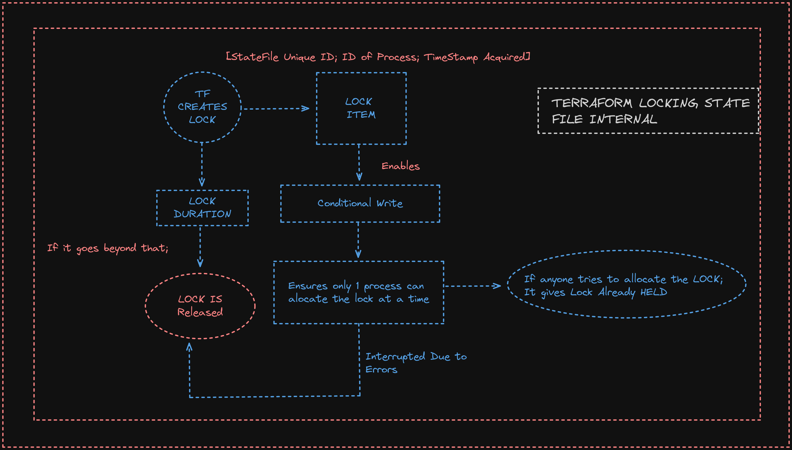

## TERRAFORM QUESTIONS

### How to limit the access control in the tfstatefile ?

- Add a DynamoDb table with the `lock_id`; it ensures that only 1 person could apply lock at a time.
- Interpretation would be like as follows.
  

### How to determine if changes are done in an AWS Resources? How to find who did this ?

- If Done via AWS SERVICES we can use the =. CloudTrail

### What are different Backends for storing the TF State ?

- The backend ios most popularly stored in the `AWS S3`, then there are `Hashicorp Consul` , `Azure Blob Storage` and `Google Cloud Storage`
- When the files are kept in the backned then the Local State File can be deleted and it will be easier to maintain the versions.

### What are Benefits of using the Remote Backend?

- Improved Collabration among the Team Members.
- State Locking can be provided to prevent the Concurrent Operations.
- Enhanced Security by storeing the state data in the centrailized locations.

### How to use the TF State file in team env to prevent conflict?

- Terraform provides the `state-locking` of remote backends such that only a user can initiate terraform operation at a time.
- `S3` - It uses DynamoDB for state locking using `id` as `lockid`

### How to manage the External Sensitive Data; such as API KEYS in Terraform State?

- WE can use the external secret management tool like `Hashicorp Vault` for storing the API KEYS and Secrets.
- OR can use the `ENV_VARIABLES` [but it will go as soom as sessions terminates].

### What startegies can you employ for mamaging Terraform State across multiple environments like (Dev, Staging, Prod etc)?

- We can make use of the the `terraform workspace` to manage multiple environments with same statefile.

```
terraform workspace list
terraform workspaceselect production
terraform workspace show
terraform workspace delete test
```

### What is Drift Detection?

- It is the process of identifying the desired state declared in terraform filesand actual state of deployed infrastructure.
- Drift in infra can be due to => someone manulaly chnaging he resources in the cloud providers console.
- It comapres {tf current state of Resources} Vs {state recorded in tf state files}
- Checkout the drift in Infrastructure using ==> {terraform plan}

### What are tainted Resources?

- They are `resources which are destroyed & recreated with each "terraform apply"`

```
terraform taint aws_resource.my_example
```

### Does TF suppport multi provider Deployment ?

- YES; as TF is Cloud Agnoistic.

### What are some of the Built In Provisoners?

- File Provisioners, Dirname, abspath

### How can you upgrade plugins on TF?

- terraform init -upgrade

### How can you define dependencies in the TF?

- USing the `depends_on`

### What is terraform show?

- It is used to provide the human readable O/P from a state or Plan File.

### YOU have existing indfrastructure in the AWS not in the TF Code ? How to bring that Infra in the Terraform Control?

- If we just want the state you can either just import it using the `terraform import`
- WE want the whole code to be made; either do it by yourself or make use of the OpenSource tool using `Terraformer`

### If N people are using the TF; How to prevent team to bring up the resources in AWS/GCP which are too expensive?

- Can be a way using the `Open policy Agent`

### How to tackle secrets in TF?

- We can make the variable type as `sensitive`
- Integrate it withe External Secret Provider like Vault.

### What is the use of the Data Resources?

- DataResources are usd to refer to resources taht already exist in the AWS eg.: AWS AMI

### What is Terraform Workspace?

- They are sued to perform the isolation; here the seprate statefiles for each environment like `DEV, QA, Staging, Production`.

```
terraform workspace select <workspace_name>
```

### Terraform variable precedence order [1-4; 4 being Highest Order] ?

- 1. Environment variables
- 2. terraform.tfvars
- 3. \*.auto.tfvars
- 4. -var or --var file

- **Variable Types**: String, Number, Boolean, Array, List, Map, Set, Object, tuples

### How can we modify aonly certain resources in the Terraform?

- Use `target` flag in tf command; it will mark that resource and recreate.
- OR WE can use the `terraform taint` but should be careful
